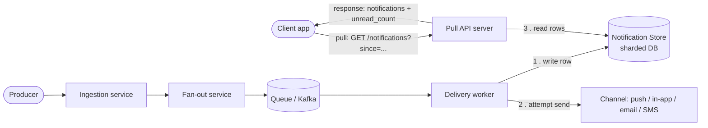
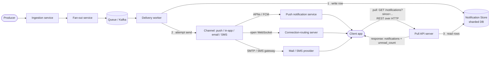

## Q1: what does ingestion mean in software term. I have heard about this but what is it exactly in general. When do we need ingestion? In what case? when we don't need ingestion? (2026-07-24)
**Ingestion**, as a general software term, means: *taking data that originates outside a system's boundary and bringing it in — durably and safely — so the system can work with it.* The word itself is borrowed from biology (to "ingest" is to take something into your body), and the software usage keeps that flavor: something outside gets absorbed into something inside.

It's not specific to notification systems — you'll see "ingestion" used across a lot of software domains:

- **Data engineering**: an "ingestion pipeline" pulls logs, CSV exports, or database change events from many sources into a data warehouse.
- **Search engines**: documents get "ingested" (parsed, validated, indexed) before they're searchable.
- **Observability**: a metrics/logging platform "ingests" telemetry from thousands of servers.
- **Notification systems** (our lesson 2 case): the ingestion service takes raw events from producers and records them durably.
- **ML systems**: training pipelines "ingest" raw datasets before cleaning/transforming them.

In every one of these, the same core job repeats: **receive something from outside, validate it's well-formed, and persist it reliably** — before anything else happens to it. That's why lesson 2 describes it as a hospital intake desk: check the ID, confirm it's legitimate, log it in the system, *then* someone can act on it.

**When you need a dedicated ingestion step:**
- Data is arriving from *outside* your trust/control boundary (a client, a third-party service, a different team's system) and needs validation before you rely on it.
- You need durability — if the event is lost before downstream processing happens, that's unacceptable (e.g., "Alice liked Bob's photo" shouldn't just vanish if the fan-out service is down).
- You want to **decouple** the rate/reliability of arrival from the rate/reliability of processing. This is the same idea as the queue in lesson 2: ingestion often writes into some durable store (a queue, a log, a database) precisely so that a downstream outage doesn't cause data loss upstream.
- Many independent producers exist, and you want one consistent front door that enforces a schema/contract, rather than every producer talking directly to every downstream system.

**When you *don't* need a separate ingestion step:**
- The whole flow happens inside a single trusted process or a single transaction, where losing the "event" mid-flight isn't a real risk — e.g., a simple function call chain within one service, or a database trigger that updates a related row in the same transaction. There's no meaningful "outside" to ingest *from*.
- The operation is synchronous request/response and the caller is fine waiting for the full result right now, with no requirement to durably record the request separately from processing it (though even here, many production APIs still push incoming requests onto a queue first purely for reliability — so this is a spectrum, not a hard line).
- The volume and stakes are low enough that if something occasionally gets dropped or reprocessing is easy, the complexity of a dedicated ingestion layer (validation, durable storage, monitoring) isn't worth it yet.

The general rule of thumb: **ingestion earns its keep when you need durability and validation at the boundary where untrusted/external data enters your system, decoupled from how fast downstream stages can process it.** If there's no real boundary being crossed, or losing/blocking doesn't matter, you can skip it and just process the data inline.

## Q2: are they components in the system or are they phases of the pipeline: Producer → Ingestion → Fan-out → Queue → Delivery worker → Channel? (2026-07-30)

Both. "Producer → Ingestion → Fan-out → Queue → Delivery worker → Channel" names the *phases* the notification's journey passes through, in order. Each phase is carried out by a distinct running *component*: Ingestion is a service, Fan-out is a service, Queue is a message broker, Delivery worker is a pool of processes, Channel is the outbound medium (push/email/SMS/in-app). "Phase" describes the sequence of work; "component" describes what piece of infrastructure executes that work — they're two views of the same six-item list, not competing answers.

## Q3: (follow-up) Draw a diagram with the database and show how the components interact with the database. (2026-07-30)

Only two components ever touch the database directly:

- **Delivery worker** — writes the notification row *before* attempting delivery through Channel (step 1, then step 2). This is the write path.
- **Pull API server** — reads rows from the database when a client calls the pull endpoint (step 3). This is the read path, and it's a separate service from the Delivery worker, not the same process — this is what lets writes and reads scale independently, and it's also how "the client accesses the database" without ever touching it directly: the client only ever talks to the Pull API server, which relays to the DB on its behalf.

Producer, Ingestion, Fan-out, and Queue never touch the database — they're all upstream of the write, concerned only with getting the "notify this user" instruction to a Delivery worker.

## Q4: in previous answer, the diagram draw channel as the end of the pipeline. I don't see how channel is connect to the client. Because in the end client is who receive the notification. (2026-07-30)

The previous diagram left Channel as a dead end because it was only showing internal components, not the last hop to the device. Channel *is* connected to the client — through a relay that sits between your system and the client, since your server can never open a connection to a phone directly (Lesson 8 covers this: "your server cannot reach a phone directly"). Which relay depends on which channel:

- **Push (mobile):** Channel → APNs (iOS) or FCM (Android) → the OS on the device → the app. Your server hands the payload to Apple/Google's push service; that service is the one actually holding a connection to the phone and wakes the app or shows the banner.
- **Push/in-app (web or live app screen):** Channel → the WebSocket connection the client already has open to a connection-routing server (Lesson 9) → the client.
- **Email / SMS:** Channel → the mail server / SMS gateway → the client's inbox or phone number. No persistent connection is involved; it's a one-shot handoff to infrastructure Apple/Google/your SMS provider owns.

Corrected diagram with that last hop included:

So the full picture: Channel never talks to the client directly — it hands off to whichever middleman actually owns the connection to that device (APNs/FCM for push, a WebSocket server for live in-app, an email/SMS gateway for those channels), and that middleman is what delivers to the client. One `Client` node receives from all three push middlemen and separately drives the pull request/response over REST — same device, two different ways data reaches it.

*(Corrected 2026-07-30: the diagram originally drew the client as four separate nodes — `ClientPush`, `ClientWS`, `ClientOther`, `ClientPull` — as if push and pull reached different clients. Fixed to a single `Client` node with edges in both directions.)*
