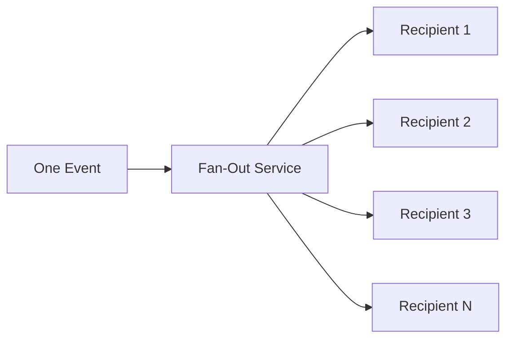
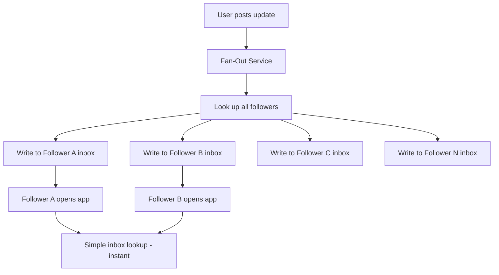
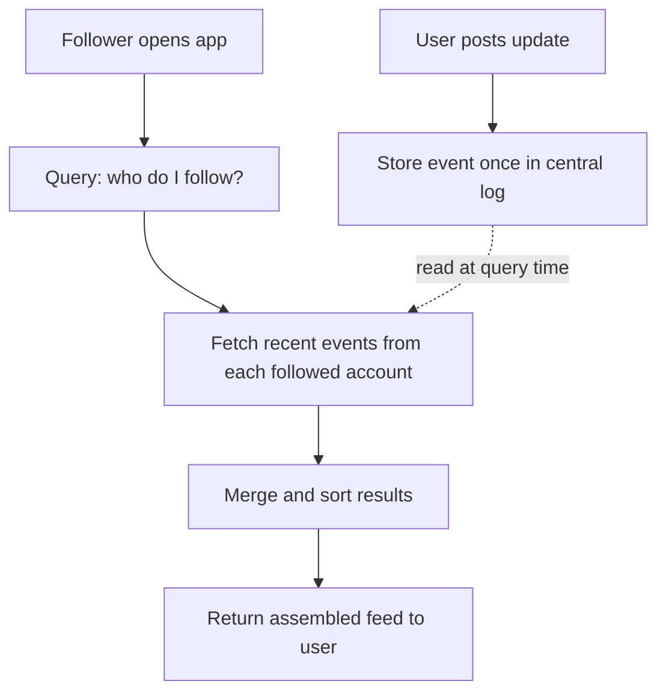
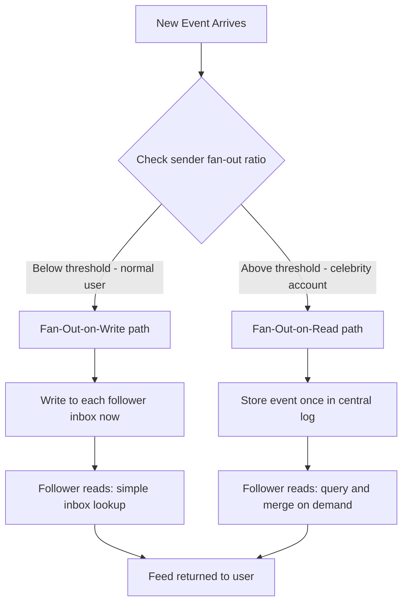
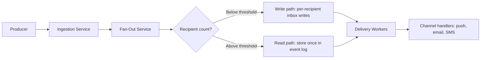

# Lesson 4: The Fan-Out Problem — Write Path vs. Read Path

You learned in Lesson 2 that the fan-out service takes one event and distributes it to many recipients. But *how* should it distribute? When a celebrity with 50 million followers posts an update, does the system immediately write 50 million notifications — or does it wait until each follower opens their inbox? This choice shapes the entire architecture. It is the single most important trade-off in notification system design.

---

## The Core Problem

One event, many recipients. A user triggers a notification — say, a new post — and 10, 10,000, or 10,000,000 people need to see it. The ratio of recipients to events is the **fan-out ratio**: if one event reaches 1,000 users, the fan-out ratio is 1:1,000.

The higher the fan-out ratio, the harder the distribution problem becomes. Two fundamental strategies exist, and each makes a different bet about where to spend computing resources.

This is the fan-out problem at its simplest: one input, N outputs. The question is *when* those N writes happen.

---

## Strategy 1: Fan-Out-on-Write

**Fan-out-on-write** means the system does all the work at write time — the moment the event happens. When a producer publishes a notification, the fan-out service immediately creates a copy (or a pointer) in every recipient's inbox. By the time any user opens their notifications, the data is already sitting there waiting.

### Real-World Analogy

Think of a postal worker who receives a newsletter and immediately makes 1,000 photocopies, then drops one into each resident's mailbox. When residents check their mailbox, the letter is already there. Fast for the resident, exhausting for the postal worker.

All the heavy lifting happens at write time. Each follower's inbox is pre-filled, so reading is a trivial lookup — no computation at read time.

### Characteristics

- **Reads are fast.** Each user's inbox is pre-computed. Fetching notifications is a simple lookup — no complex query needed at read time.
- **Writes are expensive.** One event can generate millions of write operations. If a user has 10 million followers, the system must perform 10 million inserts.
- **Latency is predictable for readers.** Since the data is pre-materialized, response times stay consistent regardless of how popular the sender is.
- **Storage cost is higher.** Every recipient gets their own copy or reference, so total storage grows with the fan-out ratio.

### When It Works Well

Fan-out-on-write shines when the fan-out ratio is low to moderate — say, under 10,000 recipients per event. Most notification systems fall into this category. A group chat notification going to 50 members, a comment reply going to 20 thread participants, or a transactional notification going to 1 user — all are comfortably handled with fan-out-on-write.

---

## Strategy 2: Fan-Out-on-Read

**Fan-out-on-read** means the system does almost nothing at write time. It stores the event once. When a user opens their inbox, the system queries all relevant sources on the fly: "Which accounts does this user follow? What did those accounts post since the user's last visit?" It assembles the notification feed in real time.

### Real-World Analogy

Imagine a library bulletin board. The newsletter author pins one copy to the board. Each resident who wants to read it walks to the library and checks the board themselves. Cheap for the author, but every reader does their own work — and if 1,000 people show up at once, the library gets crowded.

Write time is trivial — one write. All the computation happens when each follower requests their feed. The dashed arrow shows that the stored event is only read when a follower asks for it.

### Characteristics

- **Writes are cheap.** One event = one write. No matter how many followers the sender has, the write cost is constant.
- **Reads are expensive.** Each user's request triggers a query that gathers data from potentially many sources, merges it, sorts it, and returns the result. This adds latency.
- **Read latency varies.** A user following 5 accounts gets a fast response. A user following 5,000 accounts waits longer.
- **Storage is efficient.** Each event is stored once, not duplicated per recipient.

### When It Works Well

Fan-out-on-read works for users with extremely high fan-out ratios — celebrity accounts, official brand pages, or system-wide announcements. Writing a single event to 100 million inboxes would take too long and consume too many resources, so it makes sense to defer the work to read time and spread it across individual user requests.

---

## The Hybrid Approach

Most large-scale systems use neither strategy in isolation. They combine both, switching strategy based on the fan-out ratio.

**The rule of thumb:**

| Fan-Out Ratio | Strategy | Why |
|---|---|---|
| Low (< ~1,000) | Fan-out-on-write | Write cost is manageable; users get instant reads |
| High (> ~10,000) | Fan-out-on-read | Write cost would be enormous; defer work to read time |
| Medium (1,000–10,000) | Either or hybrid | Depends on latency requirements and infrastructure budget |

Twitter (now X) is the classic example. When a regular user with 500 followers tweets, the system fans out on write — it pushes the tweet into all 500 followers' timelines. When a celebrity with 30 million followers tweets, the system stores it once and fans out on read — each follower's timeline query merges in celebrity tweets at read time.

This hybrid model keeps write costs bounded while maintaining fast reads for the vast majority of users. The threshold is a tunable configuration — typical values range from 1,000 to 10,000 followers.

---

## How This Connects to the Architecture

Recall the pipeline from Lesson 2: producer, ingestion service, fan-out service, delivery workers. The fan-out service is where this decision lives. It must:

1. **Look up the recipient list** for each event.
2. **Check the fan-out ratio.** Is this a 50-person group or a 50-million-follower celebrity?
3. **Choose the strategy.** Below the threshold, write to each recipient's inbox immediately. Above the threshold, store the event once and mark it for read-time assembly.

The priority queues from Lesson 3 also interact with this choice. A high-priority transactional notification (like a password reset) always fans out on write — you never want a user to wait for on-demand assembly of a security-critical message. Bulk or marketing notifications with massive recipient lists might lean toward fan-out-on-read or batched fan-out-on-write to avoid overwhelming the system.

---

## Recap

- **Fan-out-on-write** pre-computes notifications at event time. Fast reads, expensive writes.
- **Fan-out-on-read** defers work to when users check their inbox. Cheap writes, expensive reads.
- **Fan-out ratio** — the number of recipients per event — determines which strategy fits.
- Real systems use a **hybrid**: fan-out-on-write for normal users, fan-out-on-read for high-follower accounts.
- The fan-out service in your architecture is where this routing decision happens.

---

## Check Yourself

1. A social platform has users who average 200 followers, but a few celebrity accounts have 80 million followers. If you could only pick one fan-out strategy for all users, which would you choose and what would the downside be? Now explain why a hybrid approach solves that problem.

2. A banking app sends a "suspicious login" alert to exactly one user. Which fan-out strategy applies here, and why does the fan-out ratio make the decision trivial?

3. A user follows 10,000 accounts in a fan-out-on-read system. Another user follows 5 accounts in the same system. Whose feed request takes longer, and why?
