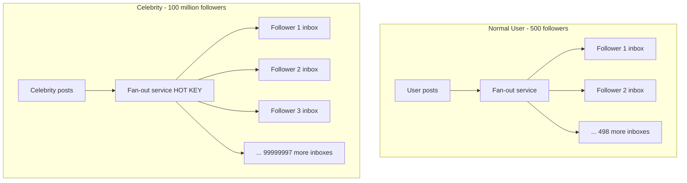
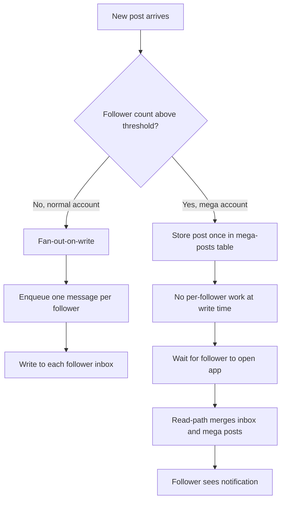
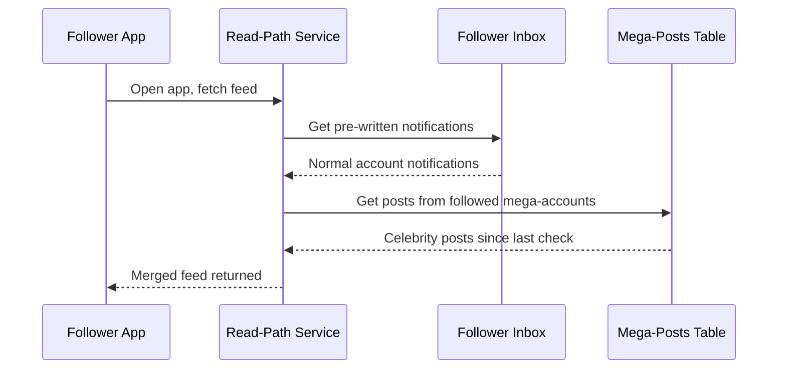
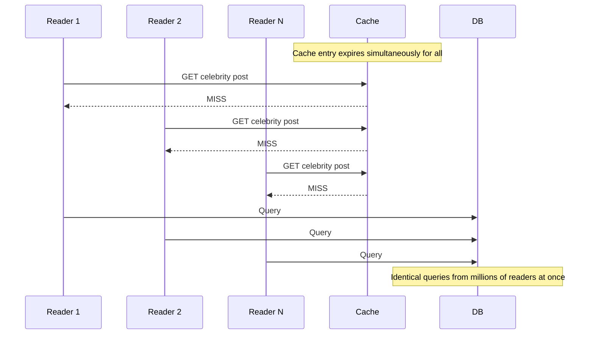

# Lesson 5: The Celebrity Problem — Hot Keys & Hybrid Fan-Out

## The Problem

Imagine a pop star with 100 million followers hits "post." Your fan-out service begins writing a notification to every single follower's inbox. That is 100 million writes from one action. The database partition holding that celebrity's data is melting. The queue worker for that shard is buried. And 100 million delivery workers all wake up at the same instant, stampeding toward your push-notification provider.

This is the celebrity problem, and it breaks pure fan-out-on-write systems.

## New Terms

**Hot key.** A single piece of data — a database row, a cache entry, a queue partition key — that receives a disproportionate share of traffic. If your system partitions by user ID, and one user triggers 100 million operations, that user's ID becomes a hot key. Its partition overloads while others sit idle.

**Thundering herd.** A sudden burst of near-simultaneous requests that overwhelms a single resource. Picture a stadium where every exit is locked except one — everyone rushes the same door.

**Hybrid fan-out.** A strategy that combines fan-out-on-write (push) for normal accounts with fan-out-on-read (pull) for mega-accounts, choosing the approach based on follower count.

## Why Pure Fan-Out-on-Write Breaks

Recall from Lesson 4: fan-out-on-write pre-computes each recipient's notification at write time. For a normal user with 500 followers, 500 writes is fine. But cost scales linearly with follower count. The difference in scale between a normal user and a celebrity is not gradual — it is a cliff.

At celebrity scale, four things go wrong:

**Write amplification.** One post becomes 100 million queue messages. Three posts in a minute means 300 million writes in 60 seconds.

**Hot partition.** All 100 million writes share the same source key. The database node or queue partition for that key becomes a bottleneck while adjacent partitions sit idle.

**Thundering herd on delivery.** All 100 million notifications try to push out near-simultaneously. Your push provider (APNs, FCM) rate-limits or rejects the burst.

**Wasted work.** Many followers are inactive. Maybe 40 million haven't opened the app in months. You spent resources writing notifications they will never see.

## The Fix: Hybrid Fan-Out

The insight: not all accounts are equal, so don't treat them the same way.

### How It Works

1. **Classify accounts by follower count.** Set a threshold — say, 500,000 followers. Above = "mega." Below = "normal."
2. **Normal accounts use fan-out-on-write (push).** Write a notification into each follower's inbox. The fan-out ratio is manageable and latency is low.
3. **Mega accounts use fan-out-on-read (pull).** Store the post once. When a follower opens the app, the read-path service checks for new mega-account posts and assembles the notification on demand.

### An Analogy

Think of a small-town newsletter versus a national newspaper. The newsletter (normal account) gets hand-delivered to each subscriber's mailbox — there are only 200 of them. The newspaper (mega account) gets printed once and placed on newsstands. Readers pick it up when they walk by.

### Where It Sits in the Architecture

Recall the pipeline: producer, ingestion service, fan-out service, priority queues, delivery workers, channels.

Hybrid fan-out modifies the fan-out service. Before fanning out, it checks follower count:

- **Below threshold:** fan-out-on-write. Enqueue one message per follower.
- **Above threshold:** store in a "mega posts" table. Skip per-follower fan-out entirely.

When a follower's client polls for updates, a read-path service merges two sources: their regular inbox (pre-written notifications from normal accounts) and the mega-posts table (posts from celebrities they follow). The diagram below shows this merge step.

The read path is more complex — two sources instead of one — but the write path no longer explodes.

### Thundering Herd in Detail

Even with hybrid fan-out, the thundering herd can appear in other places. A common scenario: a popular cache entry expires, and millions of readers simultaneously miss the cache and hit the database.

Defenses include cache-stampede locks (only one reader rebuilds the cache while others wait) and staggered TTLs (adding random jitter to expiry times so entries don't all expire at once).

### Handling the Threshold

The threshold is not magic. Some systems use a fixed number (e.g., 500K followers). Others use a dynamic threshold based on current system load. A few treat it as a spectrum: 10K followers gets full fan-out, 1M gets partial fan-out (push to active users only), and 50M gets pure pull.

## Trade-Offs

| Approach | Write cost | Read cost | Latency for followers |
|---|---|---|---|
| Pure fan-out-on-write | Very high for mega accounts | Low | Low (pre-computed) |
| Pure fan-out-on-read | Low | High for every read | Higher (computed on demand) |
| Hybrid | Low for mega accounts | Moderate (merge step) | Low for normal; slightly higher for mega |

Hybrid is a trade-off, not a free lunch. You accept more read-path complexity to avoid write-path collapse.

## Recap

- A **hot key** is a single data point overwhelmed by disproportionate traffic — like a celebrity's user ID during fan-out.
- A **thundering herd** is a burst of simultaneous requests that crushes a resource. It shows up in delivery stampedes and cache-miss storms alike.
- Pure fan-out-on-write cannot handle mega-accounts: write amplification, hot partitions, and delivery stampedes are unsustainable.
- **Hybrid fan-out** solves this: push for normal accounts, pull for mega accounts. The fan-out service checks follower count and routes accordingly.
- At read time, the read-path service merges two sources — the regular inbox and the mega-posts table — so the follower sees a complete feed.

## Check Yourself

1. A gaming platform sends notifications when streamers go live. One streamer has 80 million followers. Using pure fan-out-on-write, what two problems would you expect first? How would hybrid fan-out address them?

2. Your team sets the mega-account threshold at 1 million followers. A product manager asks: "Why not set it at 100 so we avoid fan-out for almost everyone?" What is the downside of an extremely low threshold?

3. A cache holding celebrity post data expires at the same instant for all readers. Describe what happens and name two defenses against it.
