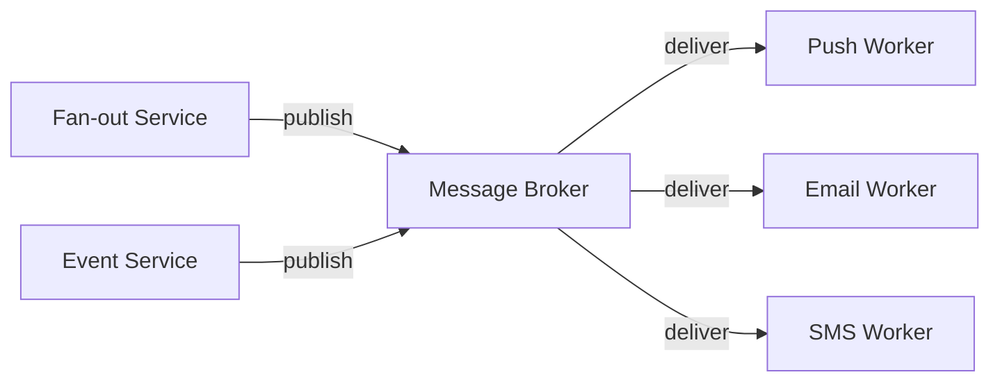
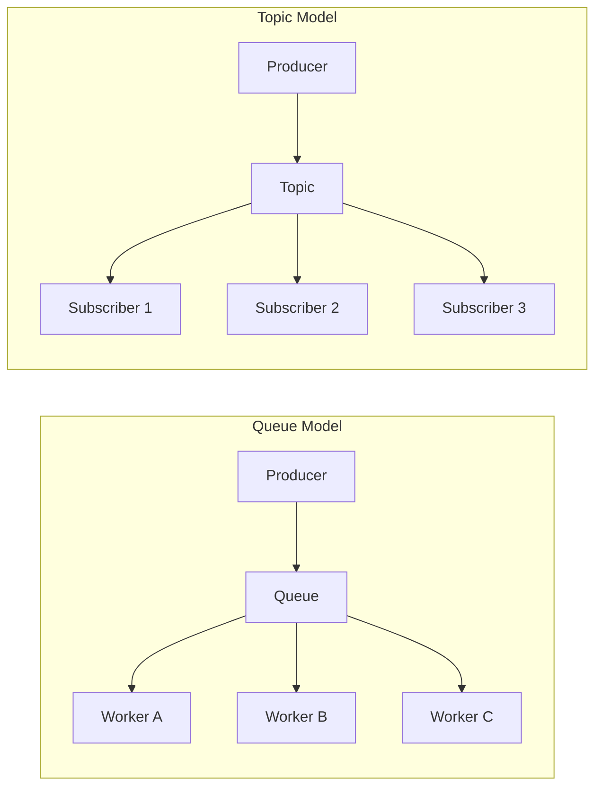
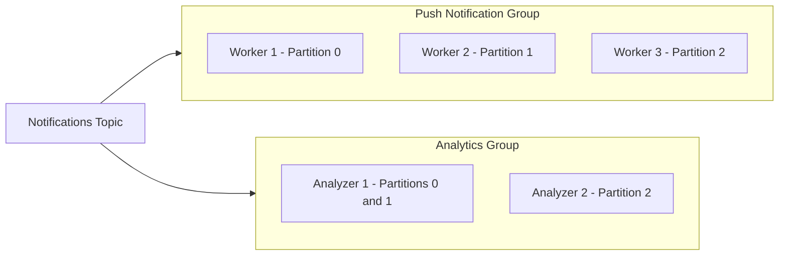
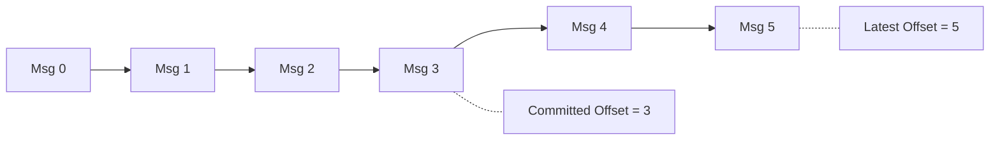

# Lesson 6 — Message Brokers & Queues 101

## Why this matters

Lesson 2 showed a queue sitting between fan-out and delivery, absorbing bursts
so traffic spikes don't crush workers. But what *is* that queue? How does it
hold millions of messages? How do workers divide load? How does the system
remember what has already been processed? This lesson answers those questions
by introducing the **message broker**.

---

## Message broker

A **message broker** is infrastructure that sits between services that produce
messages and services that consume them. Instead of Service A calling Service B
directly — waiting for a response, failing if B is down, or overwhelming B with
traffic — A sends its message to the broker and walks away. B reads from the
broker at its own pace. The broker accepts, stores, and delivers messages
reliably.

Popular brokers: **Apache Kafka** (high throughput, log-based), **RabbitMQ**
(flexible routing, traditional queue), and **Amazon SQS** (fully managed). They
differ in details but solve the same core problem: decoupling producers from
consumers.

---

## Producer and consumer

A **producer** is any service that writes messages to the broker. A
**consumer** is any service that reads messages from the broker.

In a notification system the fan-out service is a producer — it generates
"notify user X" instructions. Delivery workers are consumers — they read those
instructions and fire push notifications, emails, or SMS messages.

Key insight: producers and consumers don't know about each other. The producer
doesn't know how many consumers exist. The consumer doesn't know which service
produced the message. The broker is the only thing both sides talk to.

**Diagram 1 — Producer to Broker to Consumer.** Multiple producers write into
the broker. Multiple consumers read from it independently. Neither side knows
the other exists.

---

## Queue vs. topic

Brokers offer two ways to organize messages.

A **queue** is a simple line. Messages go in one end; one consumer reads each
message from the other end; once read, the message is gone. If three consumers
read from one queue, each message goes to exactly one of them — the work is
divided. Think of a deli counter: you take a number, whichever clerk is free
calls it.

A **topic** works differently: every message published to a topic is delivered
to *all* subscribers. If three services subscribe to the "user-activity" topic,
all three get every message. Think of a radio broadcast — everyone tuned in
hears the same song.

**Diagram 2 — Queue vs. Topic.** Queue: each message reaches exactly one
worker (work division). Topic: every message reaches all subscribers
(broadcast).

Most notification systems use topics because the same event — "Alice liked
Bob's photo" — must reach the notification service *and* the analytics
pipeline *and* the activity feed service.

---

## Consumer group

You often want *both* behaviors: broadcast to multiple services, but within
each service have multiple workers sharing the load. That is what a **consumer
group** does.

A consumer group is a set of consumers that act as one logical subscriber. The
broker delivers each message to *one* member of each group. If ten delivery
workers belong to the "push-notification" group, each message goes to exactly
one of the ten. A separate "analytics" group *also* gets every message
independently.

Internally, Kafka achieves this by splitting a topic into **partitions**. Each
partition is assigned to one worker per group. Add workers when traffic spikes,
remove them when it calms — the broker reassigns partitions automatically.

**Diagram 3 — Consumer groups with partition assignment.** The topic broadcasts
to both groups. Within each group, partitions are divided among workers so each
message is processed by exactly one worker per group. CG2 has fewer workers, so
Analyzer 1 carries two partitions.

---

## Offset

When a consumer reads messages from a topic, the broker must know where that
consumer left off — especially after a crash. An **offset** is a bookmark: a
number that says "I have processed up to message #4,207 in this partition."

**Diagram 4 — Offset tracking.** The committed offset marks the last message
the consumer confirmed as processed. Messages between the committed offset and
the latest offset have been written by producers but not yet confirmed by this
consumer. If the consumer crashes, it resumes from offset 3 and re-reads
messages 3, 4, and 5.

In Kafka, offsets are stored per consumer group per partition. When a consumer
commits its offset it tells the broker "resume from here if I crash."
Re-reading some messages after a crash is expected, which is why idempotency
(Lesson 12) matters.

In SQS the equivalent is a "visibility timeout" — a message becomes invisible
while one consumer processes it and gets deleted on confirmation. RabbitMQ uses
"acknowledgments." The idea is the same everywhere: the consumer must tell the
broker "I am done with this one."

---

## How this fits the notification architecture

Recall the pipeline from Lesson 2:

**Producer --> Ingestion --> Fan-out --> Queue --> Delivery Worker --> Channel**

The message broker *is* the queue stage. The fan-out service is a producer
writing to the broker; delivery workers are consumers in a consumer group
reading from it. When an interviewer says "we use Kafka between fan-out and
delivery," they mean a Kafka broker holds the "notifications" topic and
delivery workers form a consumer group that reads from it.

This is also why the queue absorbs traffic spikes: the broker stores messages
on disk, so producers write at whatever rate events arrive, and consumers
process at whatever rate they can manage. The gap is just a growing backlog the
broker holds patiently.

---

## Recap

| Term | One-line definition |
|---|---|
| **Message broker** | Infrastructure that decouples producers from consumers |
| **Producer** | Service that writes messages to the broker |
| **Consumer** | Service that reads messages from the broker |
| **Queue** | Delivers each message to exactly one consumer |
| **Topic** | Delivers each message to all subscriber groups |
| **Consumer group** | Set of consumers that share a topic subscription; each message goes to one member |
| **Offset** | Bookmark tracking how far a consumer has read in a partition |

---

## Check yourself

1. Three independent services — push delivery, email delivery, and analytics —
   all need to process every notification event. Would you use three separate
   queues or one topic with three consumer groups? Why?
2. A delivery worker crashes after reading a message but before committing its
   offset. When it restarts, does the message get lost, delivered twice, or
   something else?
3. Looking at Diagram 3, what happens if you add a fourth worker to the Push
   Notification Group when there are only three partitions?
