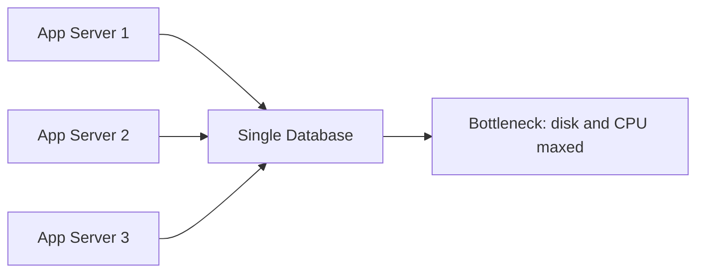
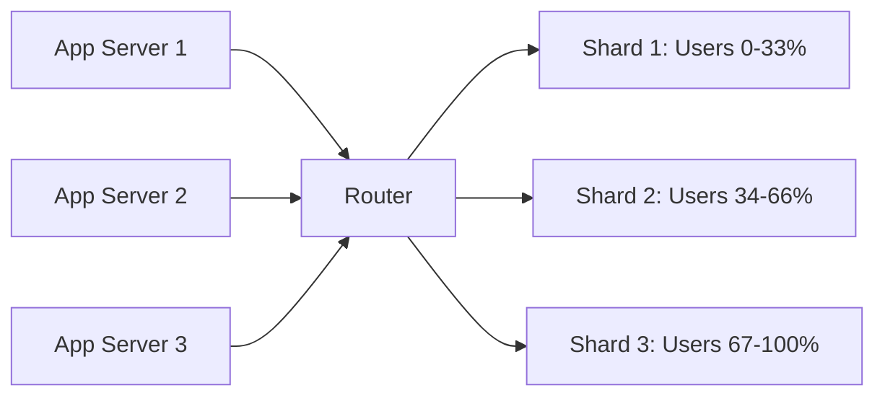
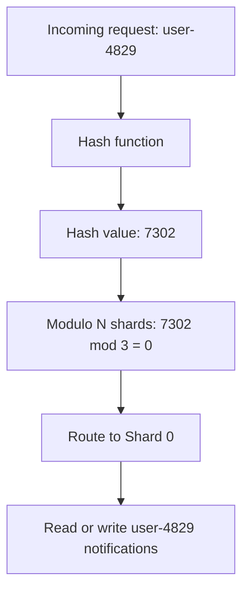
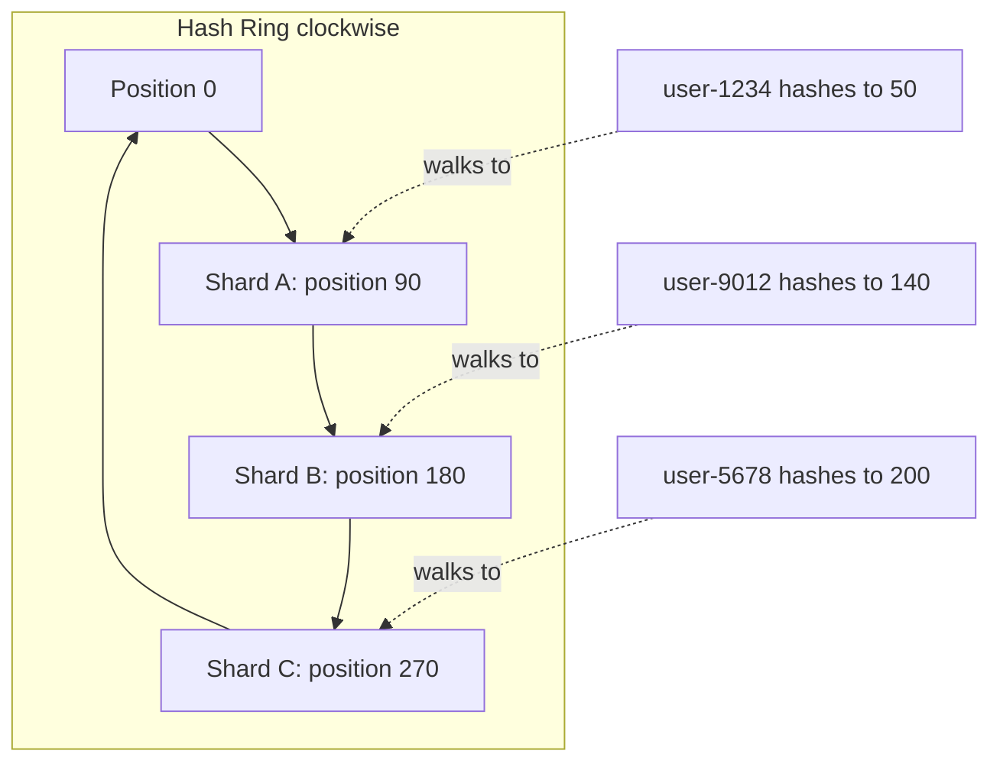

# Lesson 7 — Sharding & Partitioning for Notification Data

## Why this matters

Previous lessons covered message brokers, fanout strategies, and priority tiers.
All of those assume your notification data lives somewhere. But when "somewhere"
is a single database handling 100 million users generating billions of
notifications per day, it falls over. One machine has finite disk, memory, and
throughput. This lesson covers the technique for when one machine is not enough:
splitting data into smaller, independent pieces across many machines.

## Core vocabulary

A **partition** is an independent slice of your data. A billion notification rows
might split into 256 partitions, each managing about four million rows. Each
partition can be read and written without touching the others.

A **shard** is the physical machine or database instance holding one or more
partitions. In interviews, "shard" and "partition" are used interchangeably. The
key idea is the same: dividing data so no single node handles everything.

A **partition key** is the field that decides which partition owns a piece of
data. For notifications, the natural partition key is **user ID** — every
notification targets a specific user, so you route it to that user's partition.
All of one user's notifications sit together, keeping reads fast.

**Consistent hashing** is a way to assign keys to shards using a ring structure
so that adding or removing a shard moves only a small fraction of data instead
of reshuffling everything. More on this below.

## Single database bottleneck vs. sharded approach

When all notification data lives in one database, every read and every write
competes for the same disk, memory, and CPU. Scale the app servers all you want
— the database is still the single choke point.

Sharding breaks that bottleneck by introducing a routing layer that sends each
request to one of several independent databases. Each shard handles only its
slice of users, so total throughput scales with the number of shards.

Each shard operates independently. Adding a fourth shard roughly cuts each
existing shard's load by a quarter — no coordination needed between shards
during normal operation.

## Why user ID is the right partition key

A good partition key needs two properties:

1. **Even distribution.** Each partition gets roughly equal data and traffic.
   Randomly generated user IDs (UUIDs, snowflake IDs) spread naturally.
   Sequential IDs work too if you hash them first.

2. **Query alignment.** Most notification reads are per-user: "give me this
   user's last 50 notifications." With user ID as partition key, that query hits
   exactly one shard. Partitioning by timestamp instead would scatter one user's
   notifications across every shard, requiring expensive **scatter-gather**
   queries that fan out to all shards and merge results — slow and wasteful.

## Partition key routing: user ID to shard

Here is the path a request takes from a user ID to the correct shard:

The hash converts the user ID into a large integer. Modulo N maps that integer
to one of N shards. This is fast and simple — but breaks badly when N changes.
If you grow from 3 shards to 4, almost every key maps to a different shard,
forcing a near-total data migration. That is the problem consistent hashing
solves.

## Consistent hashing

Consistent hashing pictures the hash output range (say 0 to 2^32) as a circle —
the **hash ring**. Each shard sits at one or more points on that ring. To find
a user's shard, hash the user ID to a point on the ring and walk clockwise until
you reach the first shard.

**Adding a shard.** Say a new Shard D is inserted at position 130. It takes over
the arc from 90 to 130, which previously belonged to Shard B. Only the keys in
that arc migrate — roughly 1/N of all keys, not nearly all of them as with
modulo hashing.

**Removing a shard.** If Shard B is removed, its arc is absorbed by the next
shard clockwise. Again, only that shard's keys move.

In practice, each physical shard gets several points on the ring called
**virtual nodes**. More virtual nodes per shard means smoother distribution
across the ring. Cassandra, DynamoDB, and Kafka all use consistent hashing
internally. You rarely implement it from scratch, but interviewers expect you to
explain why modulo hashing breaks and why consistent hashing does not.

## Where sharding appears in notification architecture

**Notification store.** The table holding each user's notification history gets
sharded by user ID. Per-user inbox reads touch exactly one shard. Write load
distributes evenly across all shards.

**Message broker partitions.** Kafka topics split into partitions and producers
hash the user ID to pick one. Each partition is consumed by exactly one consumer
in a consumer group, so all notifications for a given user flow through the same
consumer in order. Order matters for badge-count accuracy and deduplication.

## Pitfalls to know

- **Hot partitions.** A celebrity account or a bot receiving millions of
  notifications concentrates traffic on one shard. Mitigations: rate limiting,
  separate handling for flagged accounts, or sub-sharding hot keys.

- **Cross-partition queries.** "Show all notifications sent in the last hour
  across all users" requires querying every shard and merging results. Solution:
  stream events to a dedicated analytics store built for full scans.

- **Rebalancing cost.** Even consistent hashing requires moving data when shards
  change. This must happen in the background while traffic continues — never as a
  stop-the-world operation.

## Recap

- One database cannot handle notification traffic at scale. Split data into
  **partitions** spread across **shards**.
- The **partition key** — almost always user ID — determines which shard owns a
  record. User ID gives even distribution and aligns with the most common query
  pattern.
- Simple modulo hashing fails when shard count changes.
  **Consistent hashing** uses a ring so only ~1/N of keys migrate when the
  cluster grows or shrinks.
- Sharding applies to both the notification database and the Kafka topic
  partitions that feed it.

## Check yourself

1. A teammate suggests partitioning notifications by creation timestamp instead
   of user ID. What problems would that cause for the query "fetch my unread
   notifications"?

2. Your system has 12 Kafka partitions and traffic has doubled. You want 4 more.
   Explain why `hash(userID) % N` would be disruptive and how consistent hashing
   reduces the blast radius.

3. Draw the consistent hashing ring with three shards. A fourth shard is added
   between Shard A and Shard B. Which keys move, and which stay put?
