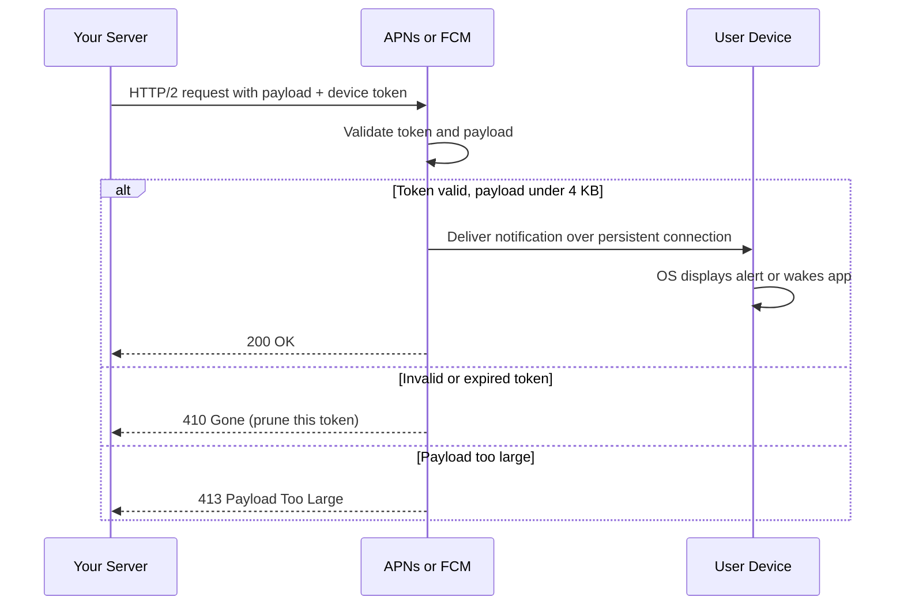
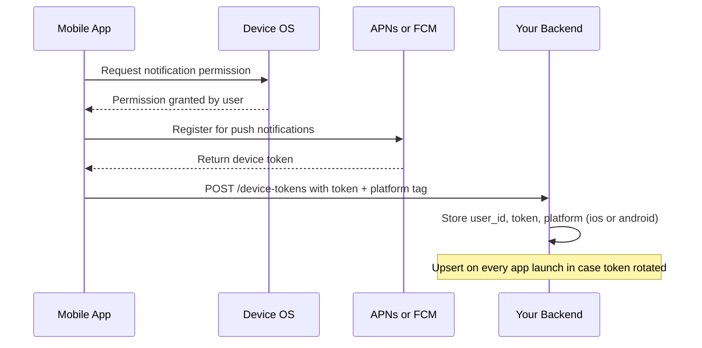
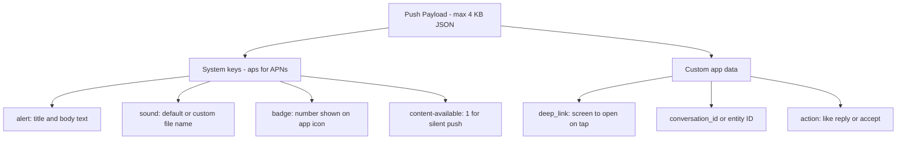
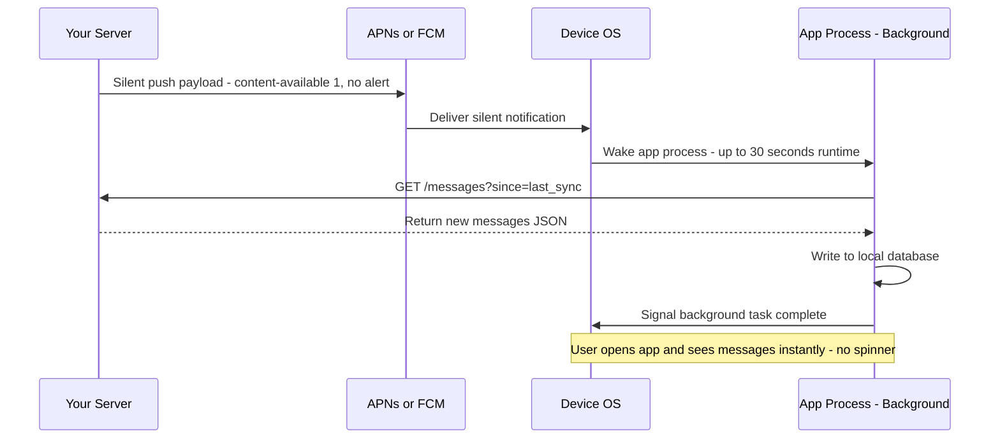
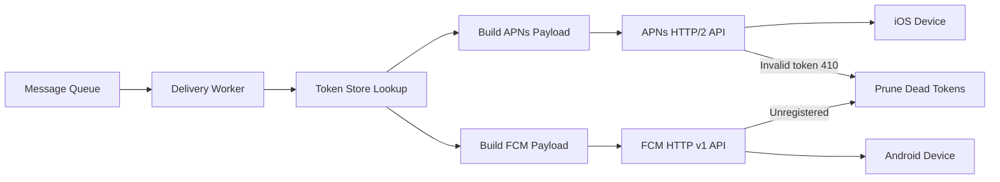

# Lesson 8 — Push Delivery Mechanics: APNs, FCM, and Device Tokens

## Why this matters

Your server cannot reach a phone directly. Mobile networks, battery
optimization, and OS security all block it. Every push notification you have
ever received was routed through a middleman operated by the device's OS
vendor. Understanding how that relay works — and the constraints it imposes —
is essential before you can design a delivery pipeline that reaches 100M+
devices.

## The push notification service: your mandatory middleman

A **push notification service** (PNS) is a cloud service run by the OS vendor
that acts as the sole gateway for delivering push notifications to devices.
Apple runs **APNs** (Apple Push Notification service) for iOS and macOS.
Google runs **FCM** (Firebase Cloud Messaging) for Android. The operating
system will not let a third-party server wake an app or show a banner without
going through its PNS.

Think of it like sending mail to a gated community. You cannot walk up to
someone's front door — you hand the letter to the postal service, and they
deliver it. APNs and FCM are that postal service.

Why do OS vendors force this?

1. **Battery life.** If every app kept its own persistent connection to its
   server, the radio would never sleep and the battery would drain in hours.
   The OS keeps one single persistent connection to its PNS, shared by all
   apps.
2. **Security and control.** The OS enforces permission rules, rate limits,
   and payload restrictions before anything reaches the screen.

The diagram below shows the full delivery path from your server to a device,
including the success and failure branches the PNS can return:

Your server never talks to the device directly. It talks to the PNS, and the
PNS handles the last hop over its persistent OS-level connection to the device.

## Device tokens: addressing a specific app on a specific phone

When your app is installed and the user grants notification permission, the
app registers with the PNS. The PNS returns a **device token** — a long,
opaque string that uniquely identifies *this app install on this device*. It
is not a phone number, not a user ID, not a device serial number.

Key properties:

- **One token per app per device.** A user with an iPhone and an iPad has two
  tokens for your app.
- **Tokens can change.** The OS may rotate a token after an OS update, a
  backup restore, or just periodically. Your server must always accept and
  store fresh tokens from the app.
- **Tokens expire or become invalid.** Uninstalling the app kills the token.
  The PNS tells you via error responses (like the 410 Gone above). You must
  prune dead tokens or risk being throttled.
- **Tokens are platform-specific.** An APNs token only works with APNs; an
  FCM token only works with FCM.

Here is the registration flow that happens when a user first installs your app
and grants notification permission:

Your backend stores a mapping of `user_id -> [list of device tokens]`, each
tagged with the platform so delivery workers know which PNS API to call.
Most users have two or three devices; some power users have many more.

## The payload: what you actually send

The **payload** is a small JSON body your server sends to the PNS along with
the device token. It contains the notification title, body text, optional
sound or badge count, and custom data your app needs — such as a deep-link
URL or a conversation ID.

The critical constraint is **size**: both APNs and FCM cap the payload at
roughly **4 KB**. In practice you have room for a short title, one or two
sentences of body text, and a few small key-value pairs. You cannot put an
image or a long article in a push payload.

Below is a simplified breakdown of what a payload contains and how each
section is used:

Because the payload is small, it is a *signal*, not the content itself. The
notification tells the user something happened and gives the app just enough
context to fetch the full content when tapped.

## Silent push and background push

A **silent push** (Apple's term) or **background push** is a push notification
that arrives on the device but shows nothing to the user — no banner, no
sound, no badge. The OS wakes the app briefly in the background and hands it
the payload. The app can then fetch new data, update a local database, or
refresh a cache before the user ever opens the app.

You trigger a silent push on APNs by setting `"content-available": 1` in the
`aps` dictionary and omitting the `alert` key. FCM has an equivalent
`data`-only message type.

Common use cases:

- **Data sync.** A messaging app fetches new messages so they are ready when
  the user opens the app — no loading spinner.
- **Content pre-fetch.** A news app pulls fresh headlines in the background.
- **State updates.** A ride-sharing app silently refreshes driver location
  without showing an alert every few seconds.

Silent pushes have stricter limits than regular pushes. Apple throttles them
aggressively — the system may delay or drop them under battery pressure — and
gives your app only about 30 seconds of background CPU time per wake-up.
Treat silent push as best-effort, not guaranteed delivery.

## How delivery workers use all of this

Recall from Lesson 2 that delivery workers sit downstream of the message
queue. Here is how they plug into the push delivery path end to end:

The worker picks a notification off the queue, looks up device tokens and
their platforms, builds a per-platform payload, and calls the appropriate PNS
API. The PNS accepts or rejects the message. Your server's job is to be a
reliable, fast *client* of these APIs — maintaining HTTP/2 connection pools,
handling errors with retries and backoff, and continuously pruning dead tokens
to stay off throttle lists.

## Recap

- You cannot push directly to a phone. You must go through the OS vendor's
  **push notification service** — APNs for Apple, FCM for Google.
- A **device token** uniquely identifies one app install on one device. Tokens
  change, expire, and are platform-specific. Your backend must keep them
  current by accepting fresh tokens on every app launch.
- The **payload** is a small JSON body (max ~4 KB) carrying alert text and
  minimal custom data. It is a signal, not the full content.
- A **silent/background push** shows nothing to the user but wakes the app
  for background work like data sync. It is throttled, best-effort, and
  capped at ~30 seconds of runtime.
- Delivery workers are clients of the PNS APIs — they look up tokens, build
  payloads, call APNs or FCM, and prune any tokens reported as dead.

## Check yourself

1. A user installs your app on their iPhone and their iPad. How many device
   tokens does your server store for that user, and why can't you reuse a
   single token for both devices?

2. You need to send a notification that includes a 10 KB thumbnail image. Can
   you put the image in the push payload? If not, what is the standard
   approach?

3. You send a silent push to pre-fetch data. Two hours later the user opens
   the app and sees stale content. What are two reasons the silent push might
   not have triggered the background fetch?
