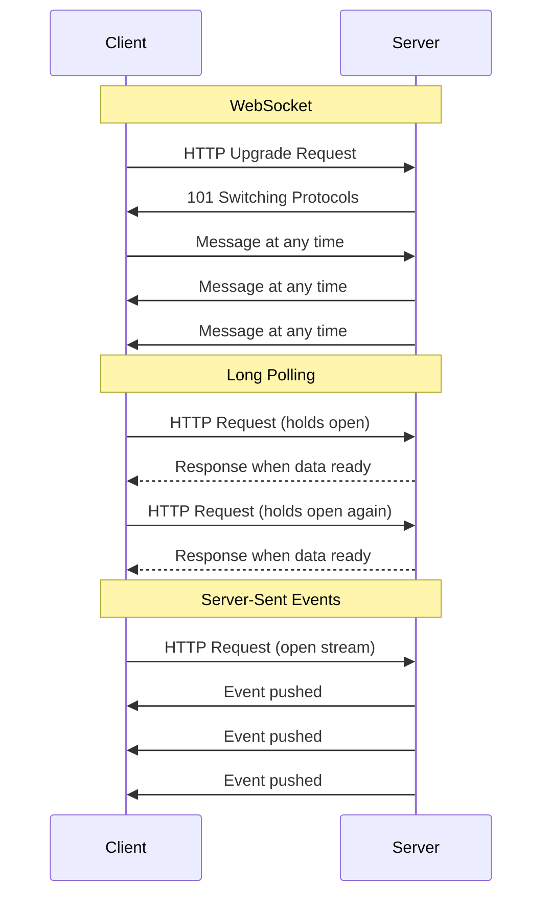
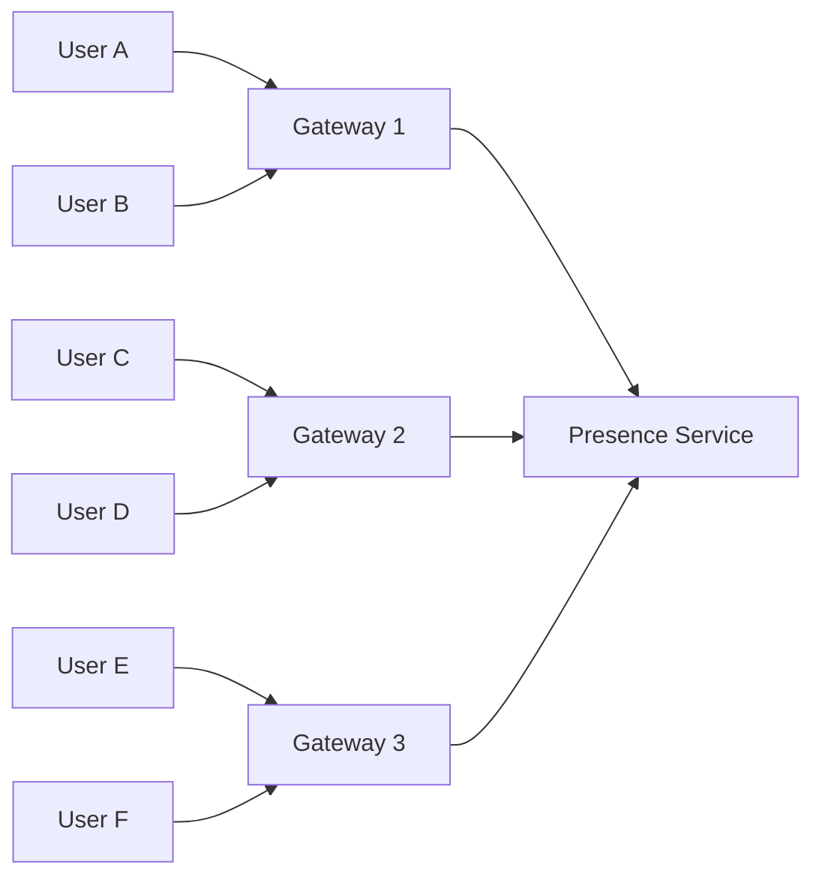
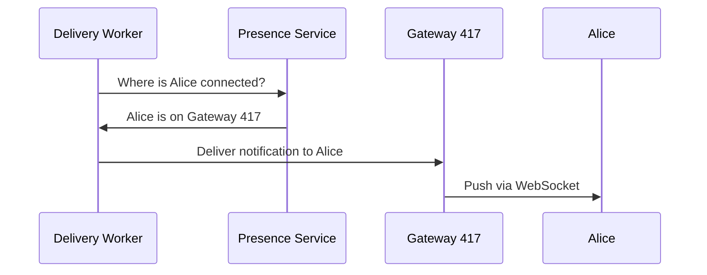
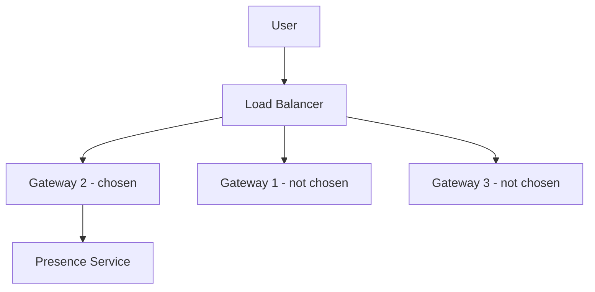

# Lesson 9 — Connection Routing: Who's Connected to Which Server?

## Why this matters

Your notification system can compose the perfect message, prioritize it
correctly, and hand it off to the right channel — but for in-app real-time
delivery, one huge question remains: *which server is this user connected to
right now?* With millions of users online and thousands of servers handling
connections, you cannot broadcast every notification to every server. You need
a routing layer that knows exactly where each user's connection lives.

## Three ways to hold a connection open

Before routing, you need to understand how a user stays connected to a server.
There are three common techniques.

**WebSocket** upgrades an ordinary HTTP request into a persistent, two-way
channel. Once the handshake finishes, both sides can send messages at any
time. Think of it like a phone call: once connected, either party can speak.
WebSocket is the gold standard for real-time features — low-latency and
bidirectional.

**Long polling** is a fallback for environments where WebSocket is unavailable.
The client sends a regular HTTP request, but the server *holds it open* until
it has something to deliver (or a timeout expires). When the response arrives,
the client immediately sends a new request. Each cycle requires a new HTTP
request with full headers, and there is a small gap between responses where
messages can queue up.

**Server-Sent Events (SSE)** is a middle ground. The client opens a single HTTP
connection, and the server pushes messages down it — but only server-to-client.
Think of it like a radio broadcast: the station talks, you listen. SSE handles
reconnection automatically but the client must use a separate request to send
data back.

| Technique | Direction | Connection | Best for |
|---|---|---|---|
| WebSocket | Two-way | Single persistent TCP | Chat, gaming, high-frequency back-and-forth |
| Long polling | One-way (simulated) | Repeated HTTP requests | Fallback when WebSocket is blocked |
| SSE | Server to client only | Single persistent HTTP | Notification feeds, dashboards, live scores |

Most large notification systems default to WebSocket and fall back to long
polling for clients that cannot upgrade.

## Gateway servers

Regardless of technique, the result is the same: each user has a persistent
connection to *one specific server*. That server is called a **gateway server**
— it holds open connections from clients and forwards messages to them. A
gateway server does little business logic; it is a switchboard.

With many users and many servers, connections spread across the fleet. Users A
and B land on Gateway 1, Users C and D on Gateway 2, and so on. Each gateway
registers its connected users with a central **presence service** so the rest
of the system knows where to find them.

## The presence service

A **presence service** is a centralized lookup registry mapping each connected
user to the gateway server holding their connection. When User A opens the app
and connects to Gateway 1, that gateway registers the mapping `UserA -> Gateway-1`
in the presence service. When User A disconnects, the gateway removes the entry.

The presence service is typically backed by an in-memory store like Redis —
lookups need to be sub-millisecond, and the data is ephemeral. If a gateway
crashes, its entries are stale and should expire via TTL.

Here is the full delivery flow from worker to user:

Step by step:

1. A delivery worker needs to push a notification to Alice.
2. Worker queries the presence service: "Where is Alice?"
3. Presence service replies: "Alice is on Gateway 417."
4. Worker sends the payload to Gateway 417.
5. Gateway 417 pushes the message down Alice's open connection.

If the presence service says Alice is not connected, the system falls back to
offline delivery — push notification via APNs/FCM, email, or SMS.

## Sticky sessions

A **sticky session** (also called session affinity) is a load-balancer rule
that pins a user's requests to the same back-end server for the lifetime of a
connection. Without it, a load balancer might route the WebSocket upgrade to
server A, then route a later HTTP request to server B, which knows nothing
about the existing WebSocket.

Sticky sessions are usually implemented by hashing the user ID or IP, or by
setting a cookie the load balancer inspects. They are simple but come with
trade-offs: if the pinned server goes down, the user must reconnect and be
re-assigned. Sticky sessions also make it harder to distribute load evenly —
an overloaded server will not shed users automatically.

For this reason, most large-scale systems combine sticky sessions (for the
connection layer) with the presence service (for routing notifications from
back-end workers). The load balancer gets you to the right server; the presence
service lets the rest of the system find that server without knowing anything
about load balancing.

## How this fits the bigger picture

In earlier lessons we covered message brokers, fanout strategies, and push
delivery mechanics. Connection routing is the last link in that chain for
real-time in-app delivery. The fanout system decides *who* gets the
notification, the message broker *queues* it, and the presence service plus
gateway servers figure out *where to push it right now*.

## Recap

- **WebSocket**, **long polling**, and **SSE** are three techniques for
  maintaining persistent connections between clients and servers.
- Persistent connections create a routing problem: you must know which
  **gateway server** holds a given user's connection.
- A **presence service** is an in-memory registry mapping user to gateway
  server, updated on connect and disconnect.
- **Sticky sessions** pin a user to one server via load-balancer rules,
  simplifying connection management but trading off flexibility.
- The combination of presence service plus gateway servers is how large-scale
  systems route real-time notifications to the correct connection.

## Check yourself

1. A user's WebSocket is connected to Gateway 200, but that server crashes.
   What happens to the user's entry in the presence service, and how does the
   system recover?

2. Your system supports 100 million concurrent users across 2,000 gateway
   servers. Why would broadcasting every notification to all 2,000 servers be
   problematic, and how does the presence service solve this?
