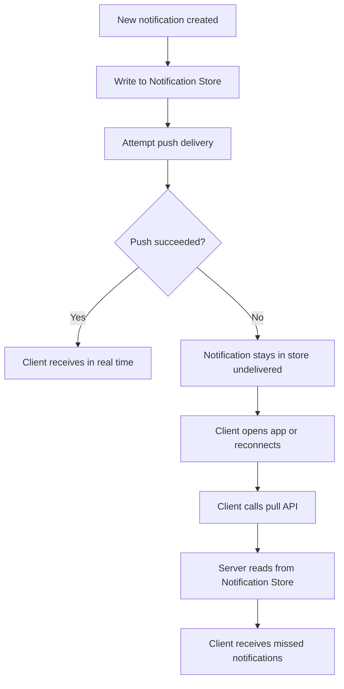
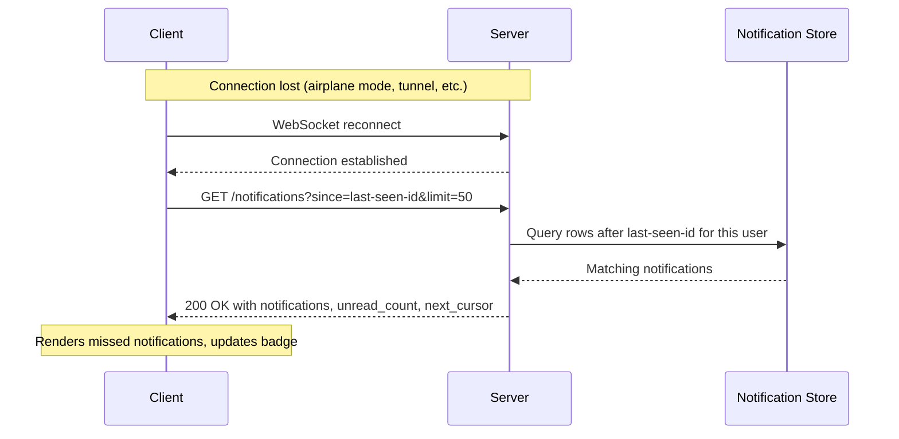
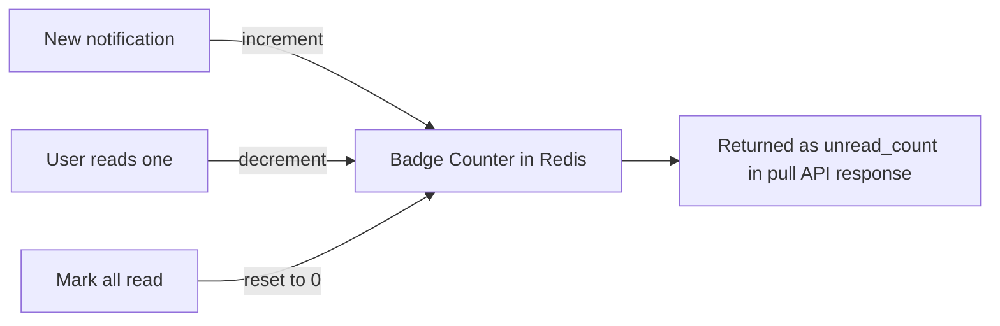
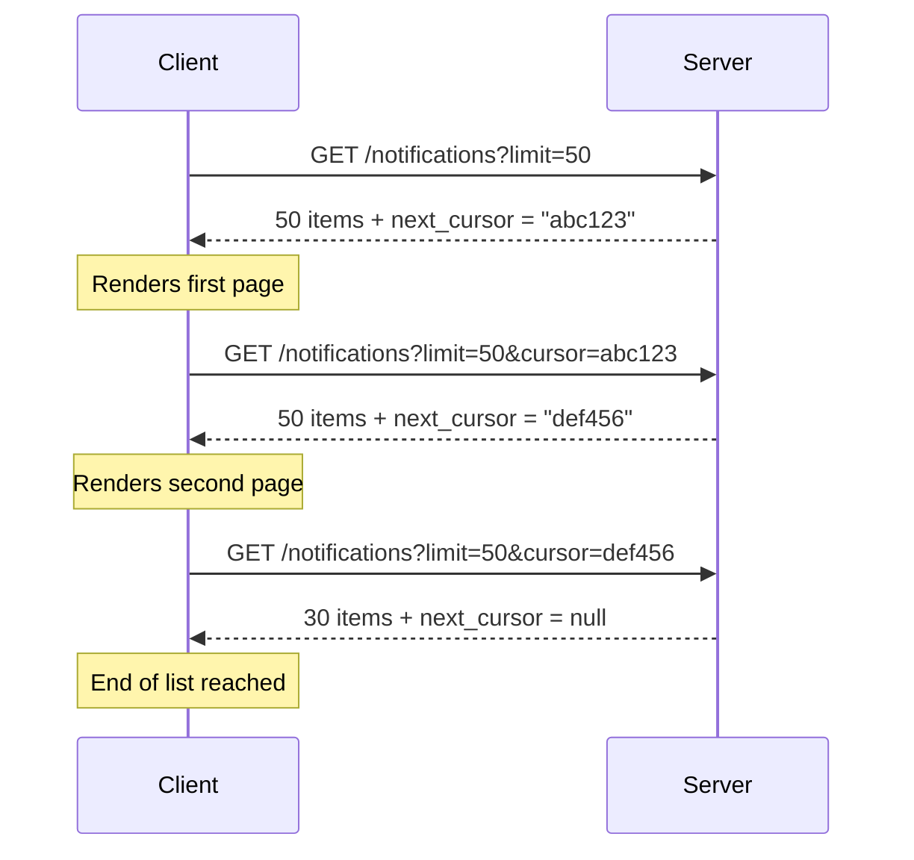

# Lesson 10 — Pull Fallback: The Backup Plan When Push Fails

## Why this matters

Push delivery is fast but fragile. Phones enter airplane mode. WebSocket connections drop in tunnels. Device tokens expire after app reinstalls. If push is your only delivery path, each failure means a permanently lost notification — and users who miss important alerts stop trusting your app.

Every production notification system solves this with a **pull fallback**: when the client reconnects, it asks the server "what did I miss?" This lesson covers three ideas that make that catch-up safe and efficient: sync-on-reconnect, badge count, and cursor-based pagination.

**New terms:** sync-on-reconnect, badge count, cursor-based pagination.

---

## Push failure and the pull fallback

Before diving into the client-side patterns, it helps to see why pull fallback works at all. Push and pull are two separate delivery paths, but they share one source of truth: the notification store. Every notification is written to the store first, then push is attempted. If push fails, the record is still in the store — waiting for the client to pull it later.



Push is the fast path. Pull is the reliable path. Because both read from the same store, no notification is ever truly lost — it just waits.

---

## Sync-on-reconnect: asking "what did I miss?"

**Sync-on-reconnect** is the pattern where a client, immediately after regaining a connection or opening the app, calls an API to fetch every notification it missed while offline.

Think of leaving a long meeting early. When you return, you ask a colleague: "What happened after I left?" You do not ask them to replay the whole meeting from the start. The client works the same way. It sends a **last-seen marker** — the ID of the most recent notification it already has — and the server returns only what came after.

```
GET /v1/notifications?since=<last-seen-id>&limit=50
```

Three common triggers fire this call:

1. **App open (cold start).** The user taps the icon; no active connection exists, so the client pulls immediately.
2. **Reconnect after network loss.** A WebSocket drops and re-establishes. The client pulls to cover the gap between disconnect and reconnect.
3. **Background wake.** Mobile operating systems periodically wake apps for a few seconds to sync. The app uses this window to pull quietly.



### Why pull instead of re-push?

If a user was offline for eight hours and received 300 notifications, re-pushing all 300 over the push channel would flood the connection and delay new, time-sensitive messages. Pull lets the client fetch at its own pace in batches, without blocking the push path.

---

## Badge count: the unread counter

The **badge count** is the number on an app icon — or a bell icon in a web UI — showing how many notifications the user has not yet read. It is not "how many arrived while offline." It is the total number of unread notifications at this moment, regardless of when they were created.

The server maintains a counter per user rather than scanning every row on each request:

- Notification created for user → increment counter by 1.
- User reads one notification → decrement counter by 1.
- User taps "mark all read" → reset counter to 0.



This counter lives in Redis or a similar fast in-memory store because clients query it on every app open and it must respond in single-digit milliseconds. A well-designed pull API returns the badge count alongside the notification list, saving a separate round-trip:

```json
{
  "notifications": [ "..." ],
  "unread_count": 12,
  "next_cursor": "eyJpZCI6MTAwMH0="
}
```

---

## Cursor-based pagination: stable scrolling

Users scroll back through notification history. The list can be long, so you need pagination. The naive approach is **offset-based**: `?page=2&limit=50` means "skip the first 50 rows, return the next 50." This breaks when new items arrive between requests. Items shift down in the list, causing the client to receive duplicates or skip entries entirely.

**Cursor-based pagination** fixes this. Instead of "skip N rows," the client says "give me 50 items after this specific item." The server returns an opaque cursor string alongside the results. On the next request, the client sends that cursor back unchanged. Under the hood the cursor encodes the sort key of the last item returned — typically a base64-encoded ID or timestamp.

Analogy: reading a book with no page numbers. Saying "start at page 40" (offset) breaks if someone tears out an earlier page. A physical bookmark — "continue after this paragraph" — works no matter what changes before it.



Because the cursor points to a specific item rather than a position, new notifications arriving at the top of the list do not disturb pages already fetched or about to be fetched.

### Trade-off

Cursor-based pagination does not support random-access jumps ("go to page 7"). You can only page forward — or backward with a separate previous-cursor. For notification history this is acceptable because users scroll sequentially. It would be awkward for a UI that needs arbitrary page jumps.

---

## Recap

- **Sync-on-reconnect** — client sends last-seen marker on every app open or reconnect and receives only newer notifications, avoiding a full re-delivery of old data.
- **Badge count** — total unread count per user, kept as an increment/decrement counter in Redis, returned inside every pull response to avoid an extra round-trip.
- **Cursor-based pagination** — uses an opaque pointer to a specific item instead of a numeric offset, preventing duplicates and skipped entries when new data arrives between pages.
- Push and pull share the same notification store. Push is fast; pull is complete. Together they cover every delivery scenario.

---

## Check yourself

1. A user's phone was in airplane mode for six hours. When they reconnect, how does the app know which notifications to fetch — and why is pulling better than having the server re-push all of them?

2. You are paginating with offsets (`?page=3&limit=20`). Between your page-2 and page-3 requests, five new notifications arrive at the top. What goes wrong, and how does cursor-based pagination prevent it?

3. A notification arrives, the badge counter increments to 5, and the user reads that notification before the next pull API call. What does `unread_count` equal in the next pull response, and why?
