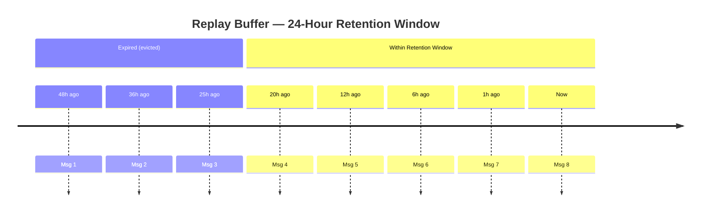
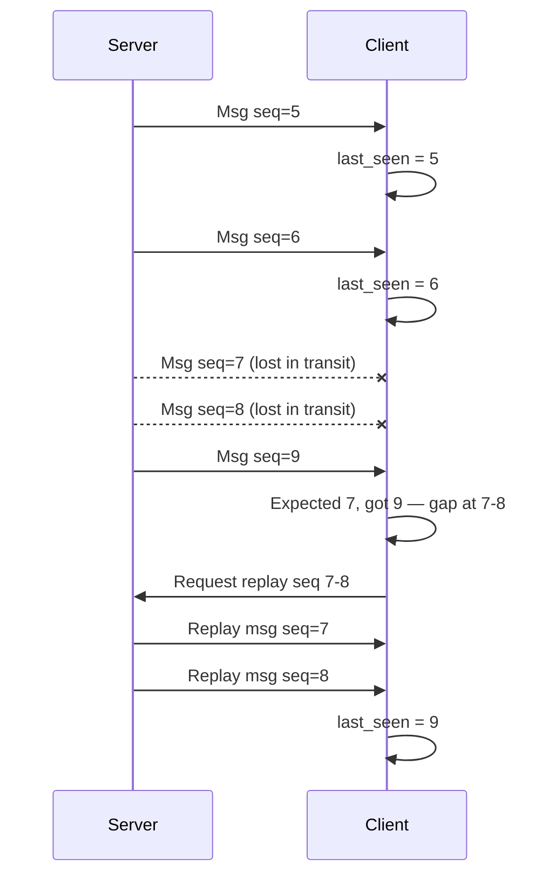
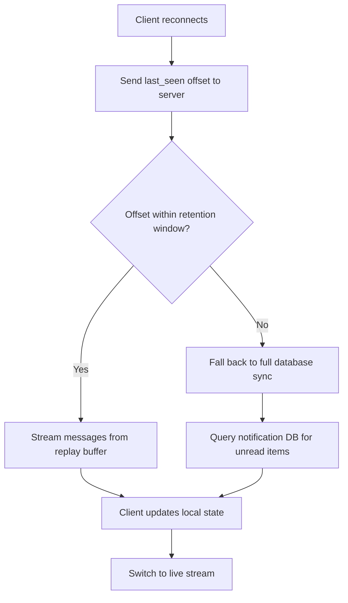
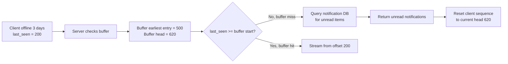

# Lesson 11 — Replay Buffers & Missed-Message Recovery

## The Problem: What Happened While I Was Gone?

Your phone loses signal in a subway tunnel for three minutes. When it reconnects, your messaging app needs to catch up. How does it know what it missed? Where does it get those messages without making the server redo all the work?

This is the problem replay buffers solve.

---

## New Terms

- **Replay buffer** — a short-term ordered log of recently sent notifications, addressable by position, so reconnecting clients can catch up without hitting the main database.
- **Retention window** — the time period (or size limit) for which the buffer keeps messages; entries older than the window are evicted.
- **Gap detection** — the client-side mechanism that notices a hole in the sequence of received messages and triggers a replay request.

---

## Core Concepts

### Replay Buffer

A replay buffer is a short-term store that keeps a copy of every recently sent notification, indexed by position. Think of it like a DVR for your notification stream: the live broadcast keeps going, but the last N hours are recorded so anyone who missed something can rewind and catch up.

When a client reconnects, it says: "The last message I saw was at position 4,821." The server checks the replay buffer, finds everything from 4,822 onward, and streams it back. No need to re-query upstream databases or re-run delivery logic. The work was already done — it just needs to be re-sent.

In practice, a replay buffer is usually backed by an ordered log — Redis Streams, Apache Kafka, or an append-only database table. The key property is that entries are ordered and addressable by position.

### Retention Window

A retention window is the time period (or size limit) for which the replay buffer keeps messages. Messages older than the window are evicted.

Why not keep everything forever? Cost and relevance. Storing every notification ever sent to 100M+ users adds up fast. If a user has been offline for a month, replaying 30 days of notifications is a worse experience than pulling fresh state from the database.

| Window size | Pro | Con |
|---|---|---|
| Short (1-4 hours) | Low storage cost | Clients offline longer must full-sync |
| Medium (12-24 hours) | Covers overnight disconnects | Moderate storage |
| Long (3-7 days) | Handles weekend outages | High storage cost, stale data risk |

Most systems land on 12-24 hours, covering the common cases: a phone losing connectivity, an app killed by the OS, or a user sleeping.

### Gap Detection

Gap detection is the mechanism a client uses to realize it missed messages. You cannot recover what you do not know you lost.

The most common approach uses sequence numbers. Every notification carries a monotonically increasing sequence number. The client tracks the last number it received. When a message arrives with a number higher than expected, the client knows a gap exists.

The client expected sequence 7 next but received 9. It detects the gap at 7-8 and requests exactly those messages from the replay buffer — not the whole history, just the hole.

Other gap detection strategies exist: timestamp-based (simpler but vulnerable to clock skew) and vector clocks (handles partial ordering in multi-source systems). For most notification systems, per-user sequence numbers are sufficient.

---

## How It Fits Together

Here is the full reconnection flow, combining all three concepts:

1. **Client connects** and sends its last known sequence number.
2. **Server checks the replay buffer.** If the sequence number falls within the retention window, it streams all messages from that point forward. This is the fast path.
3. If the sequence number is older than the retention window, the server falls back to a **full sync** — querying the notification database directly.
4. **Client processes replayed messages**, updates its local state, then switches to the live stream.

This two-tier design matters. The replay buffer handles 95%+ of reconnections cheaply. The full sync is the slow, expensive fallback for edge cases. Without the replay buffer, every reconnection would hit the database.

### Buffer Miss: When the Client Has Been Gone Too Long

What happens when the buffer no longer has the client's messages?

The client's offset (200) is older than the buffer's earliest surviving entry (500). The server cannot replay from the buffer, so it queries the main database for unread notifications and resets the client's sequence number to the current head. The client starts fresh from now.

### Scaling Replay Buffers

At 100M+ users, even a simple buffer needs thought:

- **Storage**: 50 notifications/day at 1 KB each, 24-hour buffer, 100M users = roughly 5 TB across a Redis cluster.
- **Partitioning**: Shard by user ID so each reconnecting client hits one shard.
- **Eviction**: Use TTL-based expiration so old entries clean up automatically.

### Idempotency Matters

Replayed messages may include notifications the client already processed before disconnecting. Clients must handle duplicates by checking the sequence number or message ID against local state before displaying a notification.

---

## Recap

- A **replay buffer** stores recent notifications so reconnecting clients catch up without expensive re-derivation.
- A **retention window** bounds how far back the buffer goes, balancing storage cost against coverage of common offline durations.
- **Gap detection** (usually via sequence numbers) lets clients discover missed messages and request exactly the range they need.
- When the gap exceeds the retention window, the system falls back to a full database sync.
- Clients must be idempotent — replays can include duplicates.

---

## Check Yourself

1. A user's phone dies at 11 PM and they plug it in at 7 AM (8 hours later). Your replay buffer has a 4-hour retention window. What happens when the app reconnects, and what would you change to avoid this scenario?

2. Your system uses per-user sequence numbers for gap detection. A client reconnects and reports its last sequence number as 500, but the server's replay buffer starts at sequence 450 and the current head is 520. Describe exactly what the server sends back and why the client might receive some messages it already saw.
