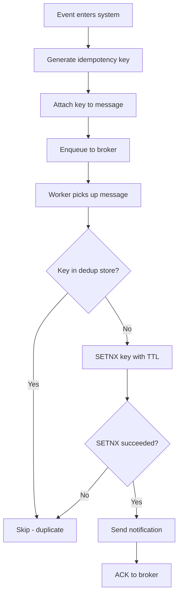
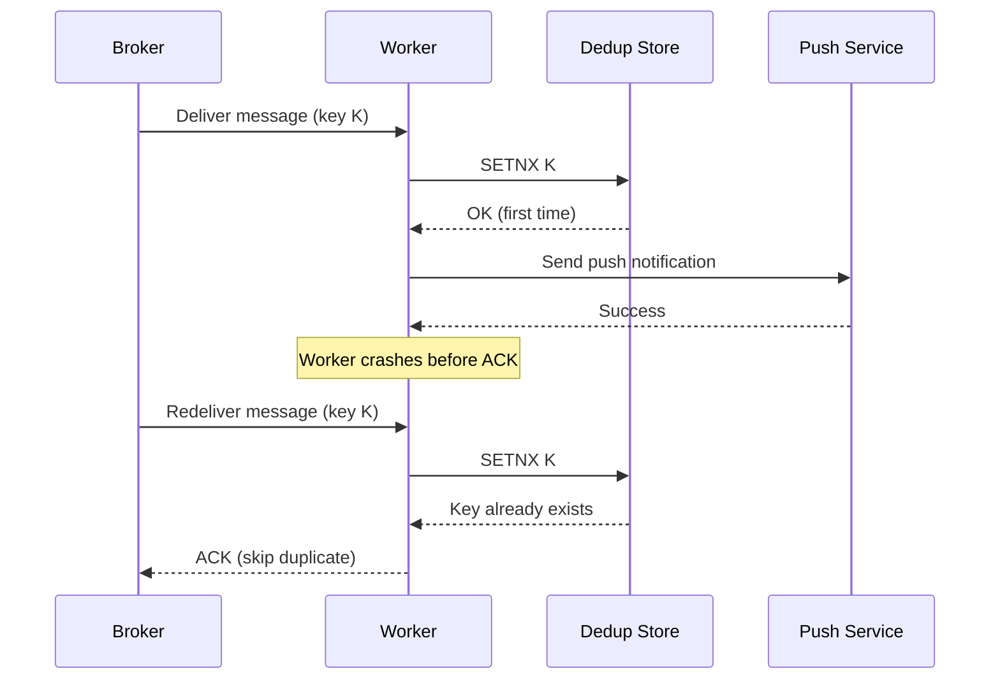
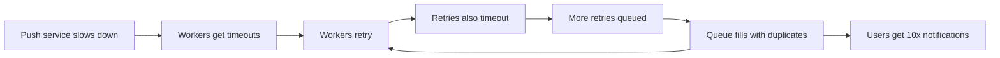

# Lesson 12 — Idempotency & Deduplication: Avoiding Double Notifications

## Why this matters

Your friend texts you "dinner at 7?" You get one text — great. Now imagine
your phone glitches and shows the same text three times. Notification systems
hit this problem constantly: networks drop, workers crash, queues retry — and
every retry is another chance to send the same notification twice. At scale,
"twice" can mean millions of duplicate pushes flooding phones in seconds. This
lesson covers the tools that prevent that.

## What is idempotency?

**Idempotency** means performing an operation multiple times produces the same
result as performing it once. Pressing an elevator button is idempotent: the
first press calls the elevator, the next ten presses change nothing. A
notification send is idempotent if the system recognizes "I already sent this
one" and skips the duplicate instead of firing it again.

In distributed systems, retries are not a bug — they are a feature. When a
worker sends a push notification and never gets an acknowledgment back, the
safe thing to do is retry. But the original send might have succeeded — the
acknowledgment just got lost. Without idempotency, every retry becomes a
duplicate notification on someone's phone.

## Idempotency keys

An **idempotency key** is a unique identifier attached to each logical
notification event so retries can be recognized. Think of it like a receipt
number: the first time the system sees receipt #4829, it processes the
notification; every subsequent time it sees #4829, it says "already handled"
and skips it.

A good idempotency key is:

- **Deterministic**: the same logical event always produces the same key. A
  common pattern combines event type, target user, and source entity — e.g.,
  `like:user-42:post-7731`.
- **Unique per logical event**: different events produce different keys. If
  Alice likes post 7731 and Carol also likes post 7731, those are two separate
  notifications for Bob with two different keys.

The key is generated early — ideally when the event first enters the system —
and travels with the message through every queue, worker, and retry.

The diagram below shows how an event flows from entry point to worker, picking
up its idempotency key along the way, then hitting the deduplication store
before any send decision is made.

The `SETNX` (set-if-not-exists) step is critical: it combines the check and
the write into one atomic operation. Without atomicity, two workers could both
check, both see "not present," and both send.

## The deduplication store

An idempotency key is useless without somewhere to look it up. That somewhere
is the **deduplication store** (dedup store): a fast data store that records
which keys have already been processed. Redis and Memcached are common choices
because they keep data in memory for sub-millisecond lookups.

Each entry has a **TTL** (time-to-live) — how long the key stays before
automatic deletion. A 24-hour TTL is typical since retries happen within
seconds or minutes, not days. TTL keeps the store from growing without bound.

## How retries trigger duplicates — and how dedup stops them

When a worker sends a notification but crashes before acknowledging the message
back to the broker, the broker redelivers that message. Without deduplication,
every redelivery produces another notification on the user's phone.

The sequence below shows exactly what happens: the first delivery succeeds, the
worker crashes before it can ACK, the broker redelivers, and the dedup store
catches the duplicate.

The broker guarantees **at-least-once delivery** — it redelivers until it gets
an ACK. The dedup store on top gives you **effectively-once delivery**: nothing
lost, nothing duplicated.

## Retry storms

A **retry storm** is what happens when deduplication is missing or broken and
retries feed on themselves.

Here is the cascade: a downstream push service (APNs, FCM) slows down. Workers
do not get acknowledgments, so they retry. Those retries also fail, producing
more retries. The queue fills with duplicate messages, each generating its own
retries. Load snowballs — more retries mean more pressure on the already-
struggling service, which causes more failures.

Idempotency keys and the dedup store are the primary defense, but you also
need:

- **Exponential backoff**: each retry waits longer than the last (1s, 2s, 4s,
  8s...) giving the downstream service time to recover.
- **Retry caps**: a maximum number of retries (e.g., 5) so a permanently
  failed notification does not retry forever.
- **Circuit breakers** (covered in Lesson 14): if too many requests fail, stop
  sending entirely for a cooldown period.

## Before and after deduplication

The contrast between a system with and without deduplication makes the value
concrete.

## Where this fits

Deduplication plugs in at the worker layer — the same workers from Lesson 6
(message brokers) and Lesson 8 (push delivery). A worker pulls a message off a
queue, checks the dedup store, and either sends or skips. The dedup store
itself sits alongside the worker tier, typically as a shared Redis cluster.

## Recap

| Term | Definition |
|------|-----------|
| **Idempotency** | Doing an operation multiple times has the same effect as doing it once |
| **Idempotency key** | A unique ID per logical event (e.g., `like:user-42:post-7731`) that travels with the message through every retry |
| **Deduplication store** | A fast lookup (Redis, Memcached) tracking which keys have been processed, with TTL to avoid unbounded growth |
| **Retry storm** | A cascading failure where retries generate more retries, flooding users and overwhelming downstream services |

At-least-once delivery from the broker + idempotency at the worker =
effectively-once delivery.

## Check yourself

1. A worker sends a push notification and writes the idempotency key to the
   dedup store, but crashes between those two steps (the push was sent, the key
   was not written). What happens on retry, and is this an acceptable trade-off
   compared to the alternative ordering?
2. Why set a TTL on dedup store entries instead of keeping them forever?
3. Two workers pick up the same message at the exact same instant. Without
   `SETNX`, both would send. Explain why `SETNX` prevents this.
