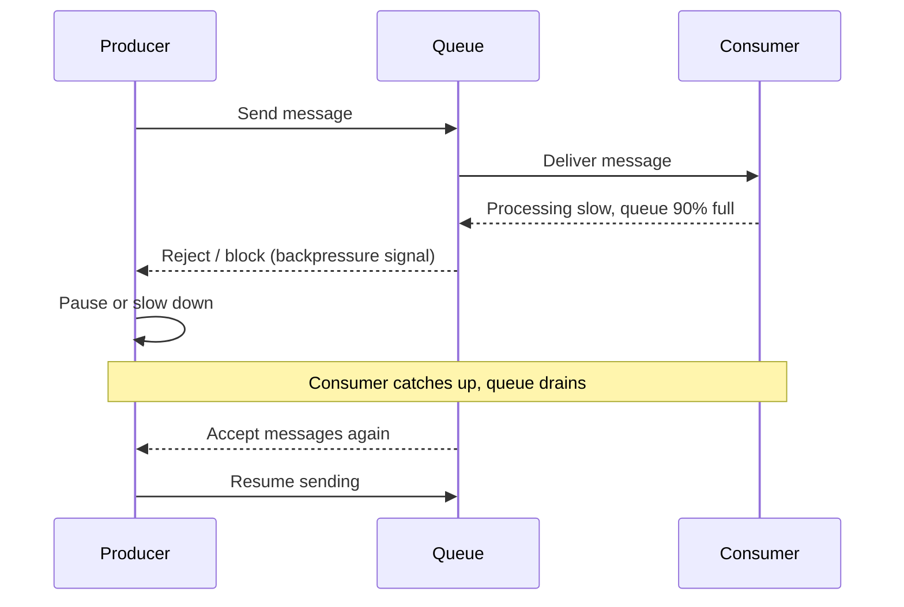
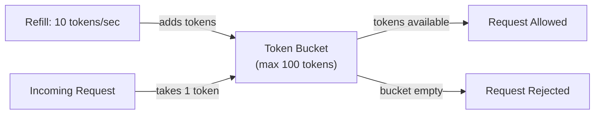
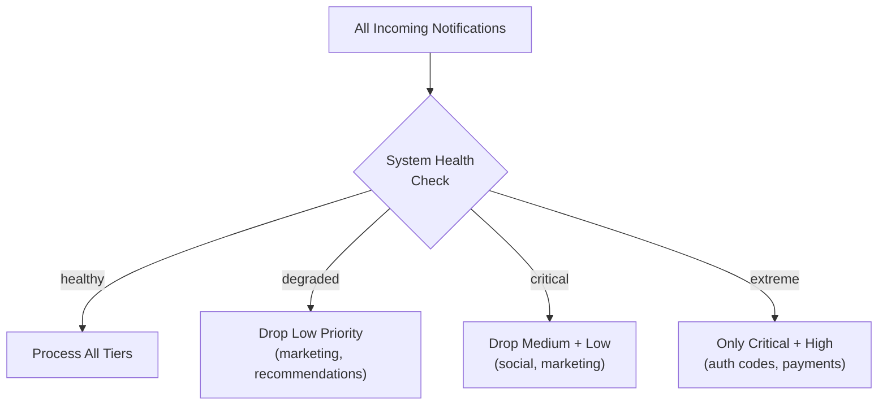
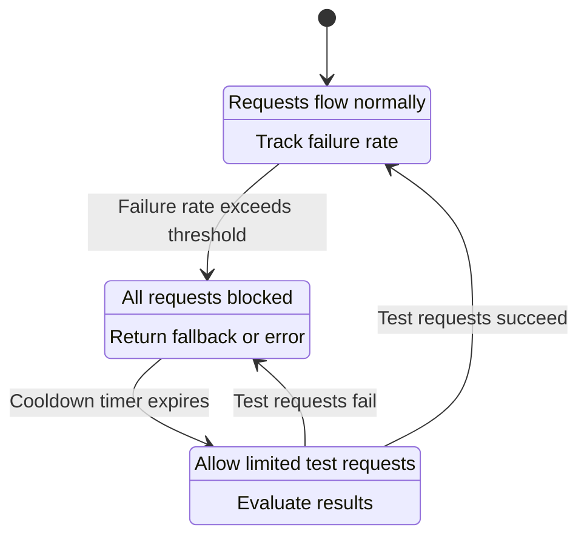

# Lesson 13: Backpressure & Rate Limiting — Protecting the System from Itself

Your notification pipeline handles millions of messages per minute — until it suddenly can't. A flash sale spikes volume 10x, producers flood work faster than consumers process it, queues grow without bound, memory fills, and everything collapses. The system's biggest threat isn't external attackers. It's its own traffic.

This lesson covers four defense mechanisms: **backpressure**, **rate limiting**, **load shedding**, and **circuit breakers**.

---

## Backpressure: Telling Producers to Slow Down

**Backpressure** is a signal from a downstream component to an upstream one: "I'm falling behind — slow down." Instead of silently accepting work into an ever-growing queue, the system pushes resistance back toward the source.

Picture a factory assembly line. The painting station handles 100 widgets per hour but welding sends 200. Unpainted widgets pile up. A smarter design: when the staging area is nearly full, a red light turns on and welding pauses. That red light is backpressure.

Common implementations:

- **Bounded queues.** Set a max size on every queue. When full, the producer's publish call blocks or returns an error. Kafka does this with `max.block.ms`.
- **Credit-based flow control.** The consumer grants the producer a fixed number of credits (permits to send). Each message costs one credit. When credits run out, the producer stops. TCP's sliding window works this way.
- **Reactive streams.** Frameworks like Project Reactor or RxJava let the subscriber request N items at a time. The publisher only emits what was requested.

Key principle: producers should never push unbounded work into the system. Every queue needs a size limit, and hitting that limit must create a visible signal.

---

## Rate Limiting: Capping How Fast Anyone Can Send

**Rate limiting** caps the number of requests a client or service can make within a time window. Backpressure is internal — between pipeline stages. Rate limiting is enforced at the edge: API gateways, ingestion endpoints, or per-tenant policies.

### Token Bucket

Imagine a bucket holding up to 100 tokens. Every second, 10 new tokens are added. Each request costs one token. If the bucket is empty, the request is rejected. Short bursts are allowed (spend all 100 at once) while the sustained rate is enforced (10/s).

**Token bucket** is the most widely used algorithm because it handles bursty traffic naturally. AWS API Gateway, Stripe, and most cloud rate limiters use it.

### Leaky Bucket

**Leaky bucket** works differently. Requests enter a fixed-size bucket and the bucket "leaks" (processes requests) at a constant rate. If the bucket overflows, excess requests are dropped. Unlike token bucket, leaky bucket enforces strictly smooth output — no bursts allowed. Think of a funnel: no matter how fast you pour water in, it drips out at the same rate.

| Algorithm | Burst Handling | Output Rate | Best For |
|---|---|---|---|
| Token bucket | Allows short bursts | Variable (up to burst) | APIs, user-facing rate limits |
| Leaky bucket | No bursts allowed | Constant | Smoothing traffic to fragile downstream services |

In a notification system, use token bucket at the API gateway (let clients burst) and leaky bucket internally to smooth delivery to APNs or FCM, which impose their own rate limits.

---

## Load Shedding: Dropping Work on Purpose

When backpressure and rate limiting aren't enough, **load shedding** deliberately drops low-priority work to protect high-priority work.

Without load shedding, all traffic degrades equally — a password-reset notification waits behind a marketing email, and both arrive late. With load shedding, the system uses priority tiers:

- **Critical** (security alerts, auth codes): never shed.
- **High** (direct messages, payment confirmations): shed only under extreme load.
- **Medium** (social interactions): shed early.
- **Low** (marketing, recommendations): shed first.

Each queue or worker checks system health — CPU, queue depth, error rate. When health crosses a threshold, the worker stops accepting anything below a certain priority tier. As load drops, lower-priority traffic is re-admitted. Think hospital triage: when the ER overflows, routine checkups get postponed so critical patients get care.

---

## Circuit Breaker: Stop Hammering a Dead Service

A **circuit breaker** monitors calls to a downstream service and stops making calls when that service is failing, giving it time to recover. Three states:

1. **Closed** (normal). Requests flow through. The breaker tracks the failure rate.
2. **Open** (tripped). Failure rate exceeds a threshold (e.g., 50% of calls failed in 30 seconds). The breaker blocks all requests and returns a fallback immediately. The struggling service gets no traffic.
3. **Half-Open** (probing). After a cooldown (e.g., 30 seconds), a few test requests go through. If they succeed, the breaker resets to Closed. If they fail, it returns to Open.

Consider delivery workers calling APNs. APNs goes down. Without a circuit breaker, thousands of workers keep sending, getting timeouts, and retrying — wasting resources and spreading failures. With a circuit breaker, the system detects APNs is down in seconds, stops sending, queues notifications locally, and probes for recovery. Libraries like Resilience4j and Polly implement this pattern out of the box.

---

## How These Mechanisms Layer

In a real notification pipeline, all four stack on top of each other:

1. **Rate limiting** at the API gateway stops abusive or misconfigured clients from flooding ingestion.
2. **Backpressure** between broker and consumers prevents queue buildup from overwhelming workers.
3. **Load shedding** inside workers drops low-priority notifications when saturated.
4. **Circuit breakers** on outbound calls to delivery providers prevent cascading failures when a provider goes down.

No single mechanism is enough. Rate limiting doesn't help when overload comes from legitimate internal traffic. Backpressure doesn't help when a downstream service is dead. Each solves a different failure mode.

---

## Recap

- **Backpressure** signals upstream to slow down when downstream is overwhelmed. Implemented via bounded queues, credit-based flow control, or reactive streams.
- **Rate limiting** caps request volume at the edge. **Token bucket** allows bursts; **leaky bucket** enforces constant output.
- **Load shedding** deliberately drops low-priority work so high-priority work survives overload.
- **Circuit breakers** stop calling a failing service, wait, then probe before resuming full traffic.
- These four mechanisms layer — each protects against a different failure mode.

---

## Check Yourself

1. Your system processes 50,000 messages per second normally, but a product launch spikes volume to 500,000/s. Walk through how backpressure, rate limiting, load shedding, and circuit breakers each contribute to keeping the system alive. In what order do they activate?

2. A downstream email provider starts returning 503 errors on 60% of requests. Explain what happens with and without a circuit breaker. What state transitions does the breaker go through once the provider recovers?
