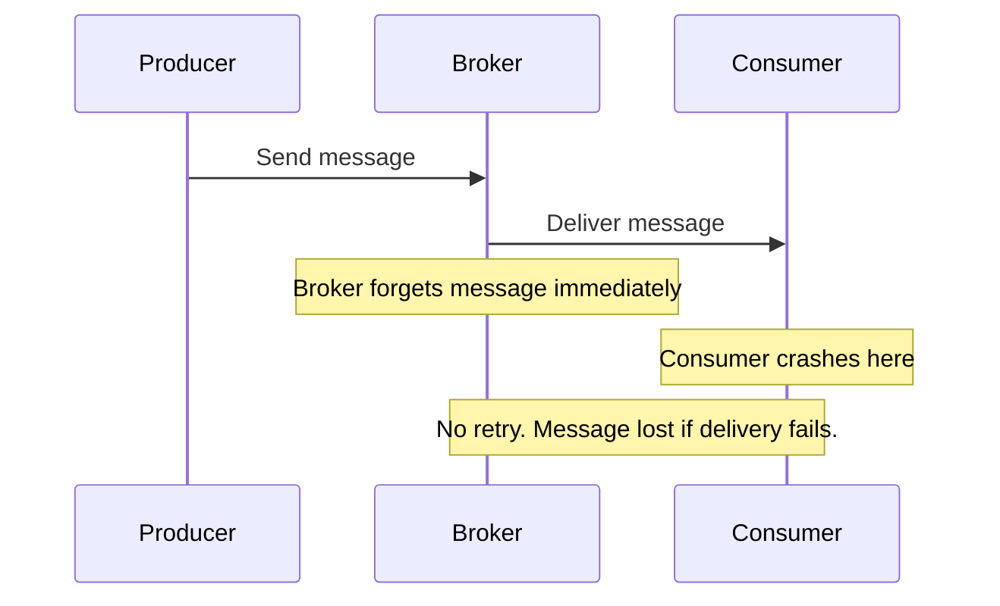
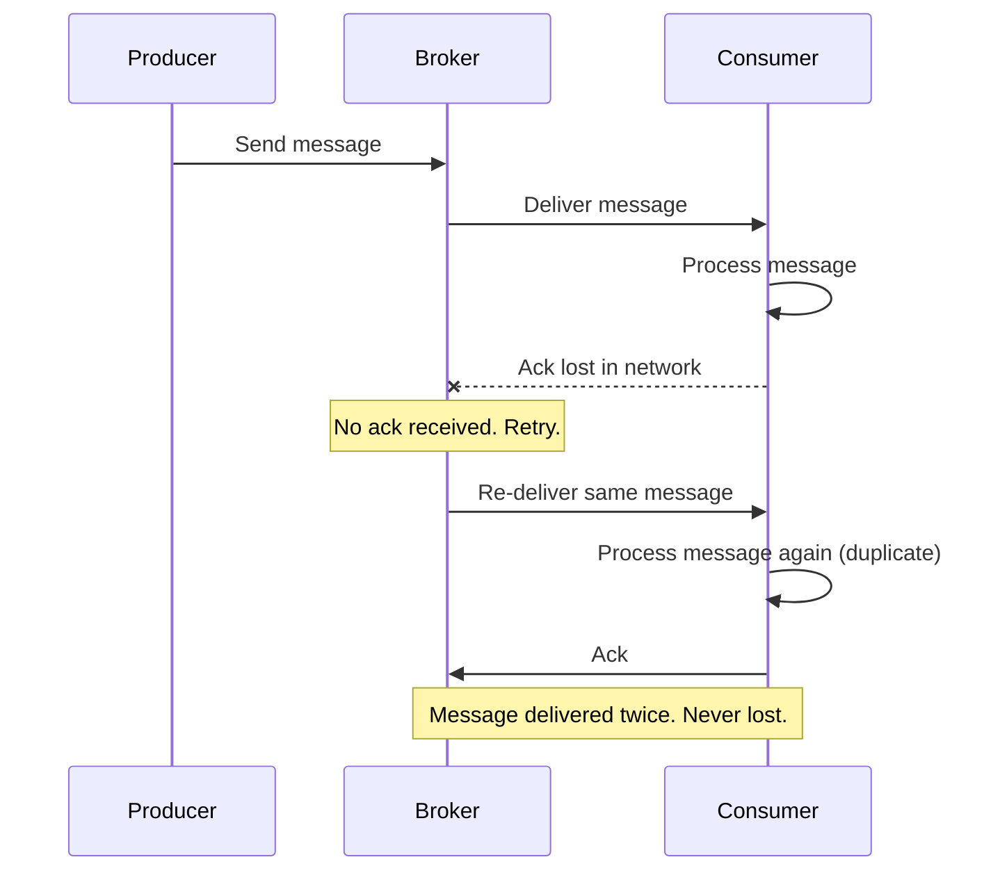
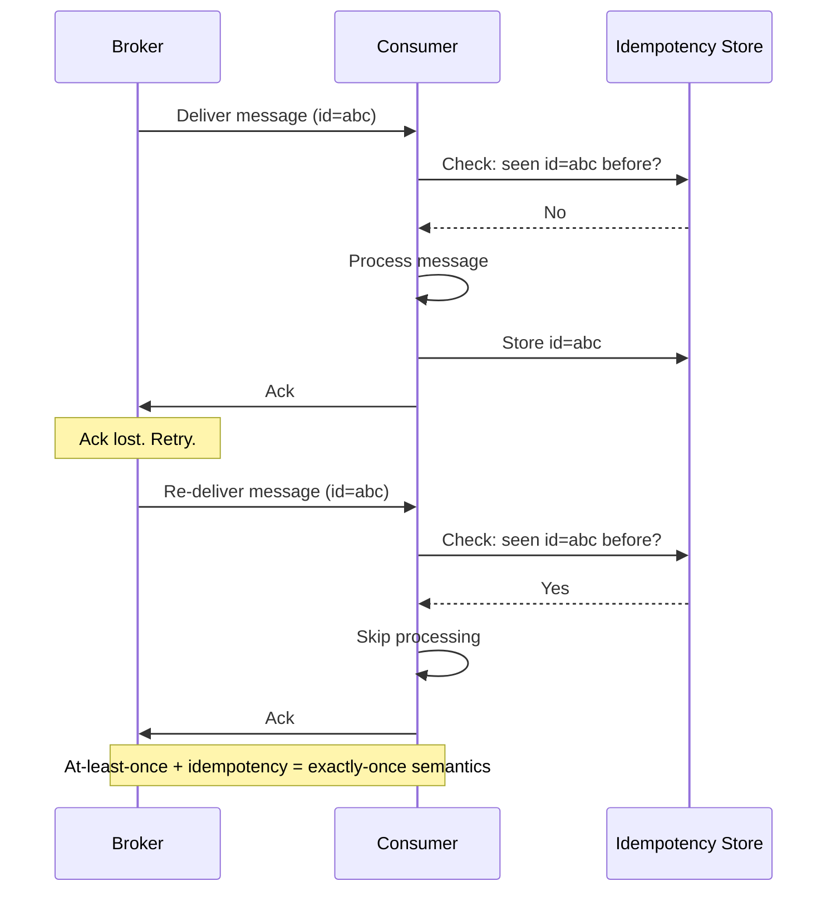
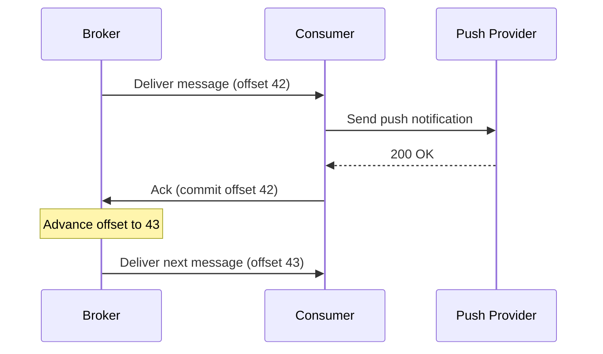

# Lesson 14 — Delivery Guarantees & Trade-offs

## Why this matters

Every notification system uses queues and brokers to move messages between
services. But what happens when something goes wrong mid-delivery — a consumer
crashes, a network blip drops a packet, a broker restarts? The answer depends
on which **delivery guarantee** the system is built around. Pick the wrong one
and you either lose messages users never see, or you spam them with duplicates.
Understanding the three delivery contracts — and knowing which one real systems
actually use — is essential for designing a notification pipeline that behaves
correctly under failure.

## New terms

- **At-most-once** — delivered zero or one times; never duplicated, but may be lost.
- **At-least-once** — guaranteed to arrive, but may arrive more than once.
- **Exactly-once** — arrives precisely one time; achieved in practice by combining at-least-once delivery with idempotent consumers.
- **Acknowledgment (ack)** — a signal the consumer sends back to the broker confirming a message was successfully processed.

## The three delivery contracts

When a broker (like Kafka or RabbitMQ) accepts a message from a producer and
hands it to a consumer, there are exactly three promises it can make about
how many times that message gets delivered.

### At-most-once

**At-most-once** means: the message is delivered zero or one times. It might
get lost, but it will never be delivered twice. The broker sends the message
and immediately forgets about it — no retries, no tracking.

Analogy: shouting a message across a crowded room. You say it once. If the
other person didn't hear you, too bad — you don't repeat yourself.

This is the simplest and fastest option. It works when losing an occasional
message is acceptable — think analytics events or debug logs where a small
gap in data doesn't matter. For notifications, at-most-once is almost never
acceptable. A user who never receives a "your flight is delayed" alert has a
real problem.

### At-least-once

**At-least-once** means: the message is guaranteed to arrive, but it might
arrive more than once. The broker keeps the message around and retries
delivery until the consumer confirms receipt with an ack. If something fails
before that confirmation arrives, the broker sends the message again — even if
the consumer already processed it but crashed before acking.

Analogy: sending a registered letter. The post office keeps trying to deliver
it until someone signs for it. If the signature slip gets lost, they deliver
the letter again — so you might get two copies, but you definitely get at
least one.

This is the most common guarantee in real-world notification systems. Losing
a message is unacceptable, and duplicates can be handled separately with
idempotency (covered in Lesson 12).

### Exactly-once

**Exactly-once** means every message is delivered precisely one time — no
losses, no duplicates. This sounds ideal. The catch: true exactly-once
delivery from the broker alone is extremely difficult in a distributed system,
because you can never be certain whether a consumer processed a message when
a network failure happens between processing and acking.

In practice, systems that achieve "exactly-once" combine **at-least-once
delivery with idempotent processing** on the consumer side. The broker retries
to prevent loss; the consumer deduplicates to prevent duplicates. Together,
these produce exactly-once *semantics* — the end result looks the same as if
each message arrived exactly once, even though messages may have been sent
multiple times under the hood.

This is the pattern from Lesson 12: store a unique message ID before
processing, and skip any message whose ID you have already seen.

## Acknowledgment (ack)

The mechanism that makes at-least-once work is **acknowledgment**, or
**ack** for short. An ack is a signal the consumer sends back to the broker
meaning "I successfully processed this message — you can stop holding onto it."

Here is the typical ack flow in a Kafka-style system:

1. Broker delivers a message to the consumer.
2. Consumer processes the message (e.g., calls the push notification provider).
3. Consumer sends an ack back to the broker.
4. Broker advances the consumer's offset — it will not re-deliver that message.

If the broker never receives the ack — because the consumer crashed, the
network dropped, or processing timed out — it assumes delivery failed and
re-delivers the message.

### When to ack: before or after processing?

This timing question determines which guarantee you get:

- **Ack before processing** (auto-ack): consumer acks as soon as it receives
  the message, before doing any work. If the consumer then crashes during
  processing, the message is lost — the broker already thinks it was handled.
  Result: **at-most-once**.

- **Ack after processing**: consumer acks only after finishing all work. If
  the consumer crashes mid-processing, the broker re-delivers. The re-delivered
  message might get processed a second time, producing a duplicate.
  Result: **at-least-once**.

For notification systems, ack-after-processing is the standard choice. You
accept the possibility of occasional duplicates and rely on idempotency to
filter them out.

## How this fits into notification architecture

In the pipeline from earlier lessons, messages flow from the fanout service
into a message broker (Lesson 6), then out to channel-specific workers
(push, SMS, email). Each worker is a consumer. The delivery guarantee is
configured at the broker-consumer boundary:

- Broker retains messages until workers ack (at-least-once).
- Workers deduplicate using an idempotency key (Lesson 12), achieving
  exactly-once semantics.
- If a worker crashes or is slow, backpressure mechanisms (Lesson 13) limit
  the rate of re-deliveries so the system doesn't spiral.

This layered approach — at-least-once from the broker, idempotency from the
consumer, backpressure from the pipeline — is how production notification
systems at companies like Facebook, Uber, and LinkedIn actually work. No
single layer solves the whole problem; the layers compose.

## Recap

- **At-most-once**: fire and forget. Fast, but messages can be lost.
- **At-least-once**: retry until acknowledged. Messages are never lost but
  may be duplicated. This is the real-world default.
- **Exactly-once**: achieved in practice by combining at-least-once delivery
  with idempotent consumers. Not a magic broker feature.
- **Acknowledgment (ack)**: the consumer's signal to the broker that a
  message was successfully processed. Ack timing determines which guarantee
  you get.

## Check yourself

1. A notification worker crashes after sending a push notification to APNs
   but before acking the message back to Kafka. What happens next, and how
   does the system prevent the user from seeing the notification twice?

2. Your team is designing a new analytics event pipeline where losing 0.1%
   of events is acceptable but duplicates would corrupt your metrics. Which
   delivery guarantee would you choose, and why?

3. What is the difference between "exactly-once delivery" and "exactly-once
   semantics"? Why does the distinction matter in practice?
