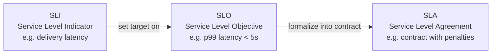
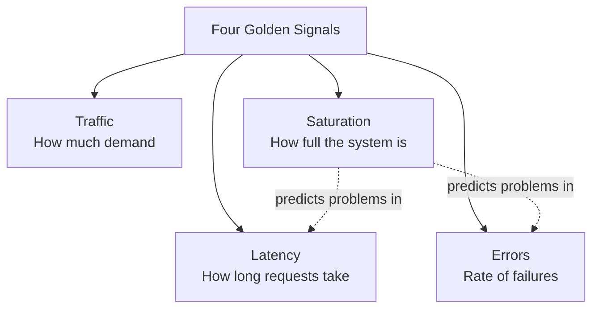
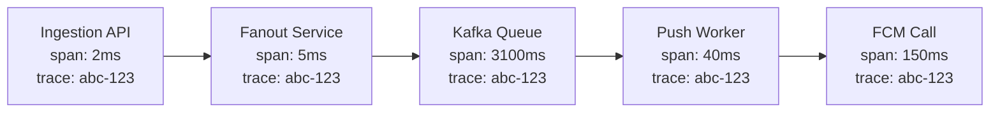
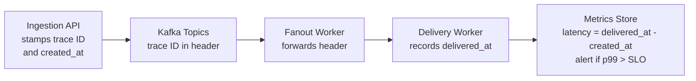

# Lesson 15 — Monitoring, Metrics & Observability

## Why this matters

You built a notification system with sharded queues, fanout pipelines, retry
logic, and multi-channel delivery. Everything works in staging. Then one
Thursday at 2 PM, push delivery latency spikes to 30 seconds for 5% of users —
and nobody notices until support tickets pile up an hour later. The system was
running, but nobody could see what it was doing. That gap is what this lesson
fills.

## Observability: more than dashboards

**Observability** is the ability to understand what your system is doing right
now and *why*, purely from its external outputs — logs, metrics, and traces.
The word comes from control theory: a system is "observable" if you can
determine its internal state from what it emits.

In practice, observability means you can answer novel questions without
deploying new code. "Why are SMS deliveries slow for users in Brazil?" should
be answerable from your desk, not by adding a print statement and redeploying.

Monitoring (watching known metrics and alerting on thresholds) is a subset of
observability. Monitoring tells you *that* something broke. Observability tells
you *why*.

## SLIs and SLOs: measuring what you promise

An **SLI (Service Level Indicator)** is a metric that captures how well your
service performs from the user's perspective. Not CPU load or queue depth —
those are internal signals. An SLI is something a user would care about. For a
notification system, useful SLIs include delivery latency, delivery success
rate, and data freshness.

An **SLO (Service Level Objective)** is a target for an SLI — a promise to
yourself (and often to customers): "99.9% of push notifications will be
delivered within 5 seconds." The SLI is "push delivery latency" and the SLO is
"99.9% within 5 seconds." Without an SLO, "latency went up" is ambiguous.

An **SLA (Service Level Agreement)** is a contractual SLO with consequences
(refunds, credits) when missed. SLAs live in legal documents. SLOs live on
engineering dashboards.

SLIs feed SLOs, and SLOs may be formalized into SLAs. Most teams define many
SLIs, fewer SLOs, and even fewer SLAs.

## The four golden signals

Google's SRE book distills the most important things to monitor into four
**golden signals**. Every component in your notification pipeline should track
these:

1. **Latency** — how long requests take. Measure successful and failed requests
   separately. In a notification system: time from event ingested to push
   delivered.
2. **Traffic** — demand on the system. Requests per second to the ingestion
   API, messages per second through Kafka, pushes per second to APNs/FCM.
3. **Errors** — rate of failed requests. Includes explicit failures (HTTP 500s,
   rejected pushes) and implicit ones (malformed payload causing a blank
   notification).
4. **Saturation** — how full the system is. Queue depth growing faster than
   consumers drain it, CPU at 90%, connection pool exhausted. This predicts
   future problems in the other three.

Saturation is your early-warning signal. Rising saturation predicts rising
latency and rising errors before they affect users.

## Percentile latency: why averages lie

Suppose delivery times over the last minute are: 50ms, 55ms, 60ms, 70ms, 80ms,
90ms, 100ms, 120ms, 200ms, 5000ms. The average is 582ms, but nine out of ten
users experienced under 200ms. The average is dragged up by one outlier — a
real user having a terrible experience, hidden by the mean.

**Percentile latency** fixes this:

- **p50** (median) — 50% of requests are faster. Your typical case.
- **p95** — only 1 in 20 users sees worse than this.
- **p99** — only 1 in 100 users sees worse.

In the example: p50 is about 80ms (good), p95 is about 200ms (fine), p99 is
5000ms (terrible). Your SLO should target a percentile, not an average. "p99
delivery latency under 5 seconds" is meaningful. "Average under 1 second" can
be met while 1% of users wait 30 seconds.

## Distributed tracing: following one notification across services

A single notification touches many services: ingestion API, priority router,
fanout service, template renderer, per-channel delivery worker, and maybe a
retry handler. When that notification is slow, which service caused the delay?

**Distributed tracing** assigns a unique **trace ID** to each request at the
edge and propagates it through every service. Each service records a **span** —
a timestamped record of work — tagged with the trace ID. Stitch spans together
and you get a timeline showing exactly where time was spent.

In this trace, the 3.1-second Kafka queue wait is immediately visible. Without
tracing, you would be guessing. Tools like Jaeger, Zipkin, AWS X-Ray, and
Google Cloud Trace implement this pattern. Every service must forward the trace
ID in headers or message metadata. If one service drops it, the trace breaks.

## End-to-end latency measurement in practice

The cleanest way to measure delivery latency as a user-facing SLI is to
bookend the full journey: stamp the notification at ingestion, record delivery
at the final worker, compute the difference. All intermediate services forward
the trace ID and creation timestamp through Kafka message headers.

This produces your end-to-end latency SLI from real delivery data — not a
synthetic probe. Aggregate into percentiles, plot p50/p95/p99 on a dashboard,
and alert when p99 crosses your SLO threshold.

## How this connects to notification architecture

Each component you built in previous lessons — ingestion APIs, Kafka topics,
fanout workers, per-channel delivery services, retry queues — needs:

- Golden-signal metrics (latency, traffic, errors, saturation).
- SLOs defined on user-facing SLIs, not just per-service numbers.
- Trace context propagated through Kafka message headers.
- Percentile-based alerting: alert on p99, not averages.

## Recap

- **Observability** = understanding what your system does and why, from its
  outputs (metrics, logs, traces).
- **SLI** = a metric measuring user-facing quality. **SLO** = the target for
  that metric. **SLA** = a contractual SLO with penalties.
- **Golden signals** = latency, traffic, errors, saturation — the four things
  every service should measure.
- **Percentile latency** (p50/p95/p99) shows real user experience; averages
  hide outliers.
- **Distributed tracing** follows one request across services by propagating a
  trace ID through every hop.

## Check yourself

1. Your notification system has an average delivery latency of 200ms but users
   complain about slow notifications. What metric should you look at instead,
   and why might it tell a different story?

2. You notice Kafka consumer lag growing steadily. Which golden signal does this
   fall under, and what does it predict about the other three if left unchecked?

3. A notification takes 8 seconds end-to-end but each individual service
   reports healthy latency. How would distributed tracing help you find the
   bottleneck?
