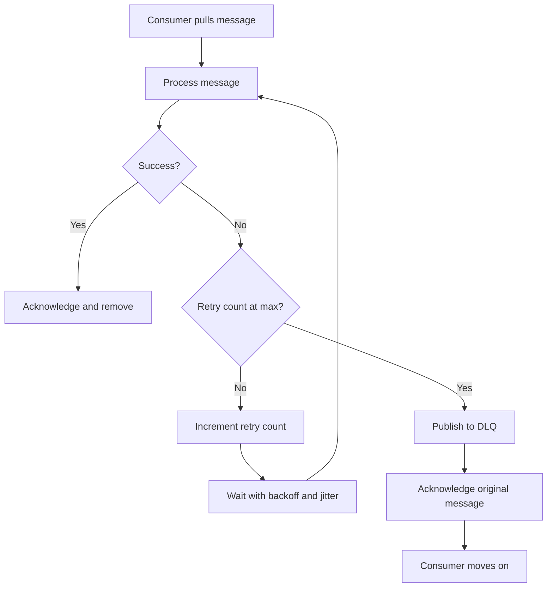
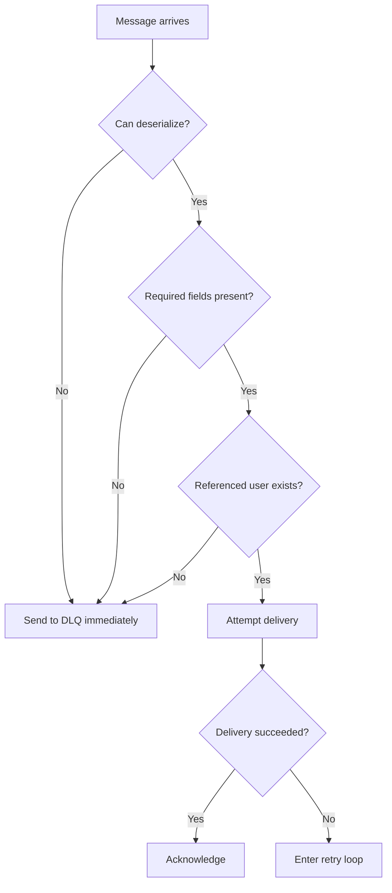
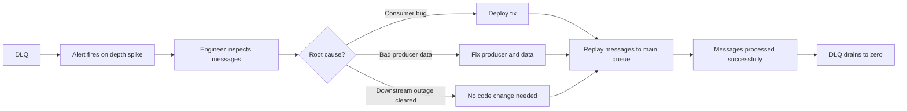

# Lesson 16 — Failure Recovery & Dead Letter Queues (DLQs)

## Why this matters

A notification system serving 100 million users will fail constantly. Push services go down. Databases time out. Networks drop packets. The question is not whether failures happen — it is whether your system handles them gracefully or grinds to a halt. This lesson covers three tools that keep your pipeline moving under failure: retry with backoff, poison message detection, and dead letter queues.

## Three outcomes for every message

When a consumer pulls a message and processes it — say, calling Apple's APNs to send an iOS push — exactly one of three things happens:

1. **Success.** The message is acknowledged and removed from the queue.
2. **Transient failure.** The downstream service returned a 503, or the connection timed out. Retrying in a few seconds would likely succeed.
3. **Permanent failure.** The message itself is broken — bad payload, missing field, deleted user. No number of retries will fix it.

The entire challenge is telling case 2 from case 3, handling each correctly, and never letting either one block messages that are perfectly fine.

## Retry with exponential backoff

**Retry with backoff** means re-attempting a failed operation after progressively longer wait periods instead of retrying immediately.

Why not retry right away? Two reasons:

- **Thundering herd.** If a downstream service hiccups and 50,000 workers all retry at the same instant, you turn a brief blip into a prolonged outage. Spreading retries over time gives the service room to recover.
- **Wasted resources.** Tight retry loops burn CPU and network bandwidth on attempts that are almost certain to fail for the same reason.

The standard approach is **exponential backoff**: wait 1 second, then 2, then 4, then 8, up to some cap. Most implementations also add **jitter** — a small random offset — to each delay. Without jitter, workers that started at the same time retry at the same time, recreating the thundering-herd problem one delay cycle later.

A typical configuration: 5 max retries, base delay 1 s, multiplier 2x, jitter +/- 500 ms, hard cap 30 s.

```mermaid
gantt
    title Retry Timeline with Exponential Backoff
    dateFormat X
    axisFormat %s s

    section Attempts
    Attempt 1 (fails)   :milestone, 0, 0
    Wait ~1 s            :w1, 0, 1
    Attempt 2 (fails)   :milestone, 1, 1
    Wait ~2 s            :w2, 1, 3
    Attempt 3 (fails)   :milestone, 3, 3
    Wait ~4 s            :w3, 3, 7
    Attempt 4 (fails)   :milestone, 7, 7
    Wait ~8 s            :w4, 7, 15
    Attempt 5 (fails)   :milestone, 15, 15
    Move to DLQ          :milestone, 15, 15
```

Each wait period roughly doubles. Jitter scatters the actual delays so multiple workers do not retry in lockstep.

## From failure to DLQ: the full decision path

When a message fails, the consumer makes a decision at each step: try again, or give up? The flowchart below shows the complete path from first failure through retries to the dead letter queue.

Key detail: after the final retry fails, the message is published to the DLQ *and* the original is acknowledged. Acknowledging removes the failed message from the main queue so it cannot block healthy messages behind it.

## Poison messages

A **poison message** is one that will never succeed, no matter how many times you retry it. Examples: truncated JSON that cannot be deserialized, a reference to a user account that was deleted, a template ID that no longer exists.

Poison messages are dangerous because without special handling they cause **head-of-line blocking**. The consumer pulls the message, fails, puts it back, pulls it again, fails again — forever. Exponential backoff just slows the loop down. It does not stop it.

The fix is early detection: check for obvious permanent-failure conditions before spending retry budget. The diagram below shows a poison message detector that short-circuits the retry loop for messages that are clearly broken.

Catching poison messages early saves retry budget for genuinely transient failures and avoids hammering downstream services with requests you know will fail.

## Dead letter queues

A **dead letter queue (DLQ)** is a separate queue where messages land after exhausting all retries. Rather than being silently dropped or blocking the pipeline, they are parked where engineers can inspect them.

The DLQ is just another queue — the difference is that normal workers do not consume it. It serves three purposes:

- **Inspection.** Engineers read DLQ messages to diagnose what went wrong: a code bug, a schema change, or a downstream outage that outlasted the retry window.
- **Replay.** Once the root cause is fixed, DLQ messages can be re-published to the main queue for another attempt. This recovers notifications that would otherwise be lost.
- **Alerting.** DLQ depth is one of the most useful operational metrics you can monitor. A fast-growing DLQ is an early warning that something is broken.

## DLQ inspection and reprocessing

Messages in the DLQ are not forgotten. The following diagram shows the operational workflow for investigating and recovering them.

This replay capability is what makes DLQs so valuable. In an at-least-once delivery system, a DLQ message has not been delivered — but it has not been lost either. It is sitting in a known state, waiting for intervention. That is far better than silent data loss.

## Analogy: the post office

A postal carrier tries to deliver a package. Nobody is home, so they leave a notice and try the next day (retry). They try a second time (the delay is longer — they are not coming back every hour). After three failed attempts, they do not throw the package away. They bring it back to the post office and park it on a "held for pickup" shelf (the DLQ). It waits there until someone claims it. The carrier keeps delivering every other package the whole time.

## Broker support

Most message brokers handle DLQs natively:

- **Kafka:** Consumers publish failed messages to a separate DLQ topic.
- **SQS:** Redrive policy automatically moves messages to a DLQ after N failed receives.
- **RabbitMQ:** Dead-letter exchanges route rejected or expired messages.

## Recap

- **Retry with backoff** re-attempts failed operations with progressively longer waits plus jitter, handling transient failures without overwhelming downstream services.
- A **poison message** will never succeed. Detect it early — before retries — to avoid head-of-line blocking and wasted retry budget.
- A **dead letter queue (DLQ)** parks messages that exhausted retries so they can be inspected, replayed, and alerted on instead of silently dropped.
- DLQ depth is a key operational metric. A fast-growing DLQ signals a live problem.
- Kafka, SQS, and RabbitMQ all have native DLQ support.

## Check yourself

1. Why is jitter important even though plain exponential backoff already spaces out retries?
2. A system drops messages after 5 failed retries with no DLQ. What operational problems does this create?
3. How does early poison message detection improve the pipeline compared to letting poison messages exhaust all retries?
