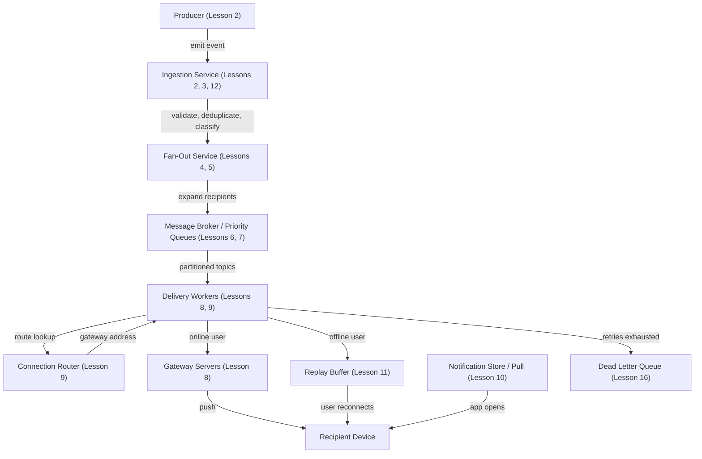
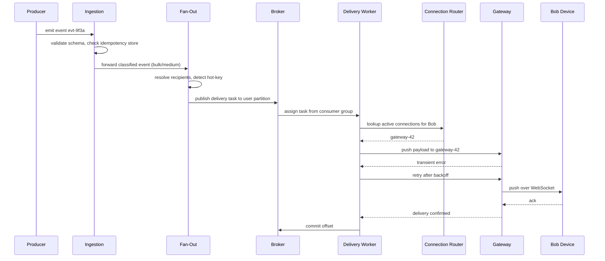
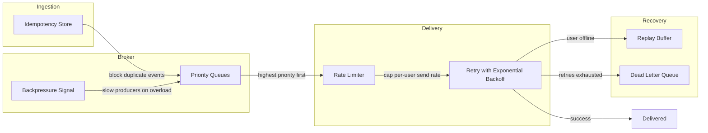

# Lesson 17 — Capstone: Full Reference Architecture Walkthrough

This lesson introduces no new concepts. It connects all sixteen prior lessons into one coherent system by tracing a single notification end to end.

---

## End-to-End Architecture

Every notification travels through the same pipeline. The diagram below shows the full data path from event creation to device delivery, including offline and failure branches.

Alice taps "like" on Bob's photo. The Likes service emits an event. Ingestion validates the payload, checks the idempotency store to drop duplicates, and classifies priority — a like is bulk/medium, a password reset is transactional/high. Fan-out resolves recipients: just Bob for a like, but millions of followers for a celebrity post (handled by hybrid fan-out from Lesson 5). Delivery tasks enter partitioned broker topics, keyed by user ID to preserve per-user ordering. Workers pick up tasks, ask the connection router which gateway holds Bob's WebSocket, and push. If Bob is offline, the event lands in the replay buffer for catch-up on reconnect; Bob can also pull from the notification store when he opens the app next.

---

## Sequence: One Notification Through the System

This sequence diagram traces a single event — `evt-9f3a` — through every component on the happy path, including one retry.

Two details matter here. First, the broker holds the message until the worker commits the offset. If the worker crashes before committing, the broker reassigns the task to another worker in the consumer group — that is at-least-once delivery. Second, the idempotency store prevents the re-delivered message from reaching Bob twice. Together these two layers produce effectively-once delivery (Lesson 14) without a distributed transaction.

---

## Resilience Layer

Safety mechanisms protect every stage. This diagram shows how resilience components overlay the pipeline to absorb failures and surges.

Each box solves a specific failure mode:

- **Idempotency** (Lesson 12): unique event IDs catch duplicate submissions from retrying producers and from at-least-once broker redelivery.
- **Backpressure** (Lesson 13): when queues grow past a threshold, the broker signals producers to slow down rather than letting ingestion crash under load.
- **Priority queues** (Lesson 7): transactional notifications (password resets, security alerts) always drain before bulk marketing messages, even during a traffic spike.
- **Rate limiting** (Lesson 13): caps the number of notifications sent to any one user per time window, preventing notification storms from degrading the user experience.
- **Retry with exponential backoff** (Lesson 16): failed deliveries retry at widening intervals (1 s, 4 s, 16 s). Backoff reduces load on a struggling downstream service.
- **Dead letter queue** (Lesson 16): messages that exhaust retries land here. They are isolated so they cannot block healthy traffic. Operators inspect, fix the root cause, and replay.
- **Replay buffer** (Lesson 11): a per-user ordered log retained for a fixed window. On reconnect, the client provides its last-seen offset and receives all missed events in order.

---

## Recap

- Notifications travel one linear pipeline: produce, ingest, fan out, broker, route, deliver, fall back.
- Hybrid fan-out prevents celebrity events from crushing ingestion or the broker.
- Partitioned topics give per-user ordering without sacrificing cross-user parallelism.
- Push is the fast path; replay buffers and pull queries are the reliable fallback for offline users.
- Idempotency at ingestion and again at the delivery worker turns at-least-once into effectively-once.
- Backpressure, rate limiting, retries, and the DLQ form layered defense — each catches what the layer above missed.
- Every component exists because of a concrete failure mode. At 100 million daily active users, none are optional.

---

## Mock Interview Prompt

> "Design a notification system for 100 million daily active users. Walk me through what happens when a user likes a post, from the moment the event is created to the moment the recipient sees the notification. Cover fan-out strategy, delivery mechanics, failure handling, and how you would know if something went wrong."

Set a 15-minute timer and explain the full system aloud. Use the end-to-end architecture diagram as your outline. For each stage, state what the component does, what breaks if it is missing, and what trade-off it represents. If you can do that for all stages without looking at notes, you are ready.
